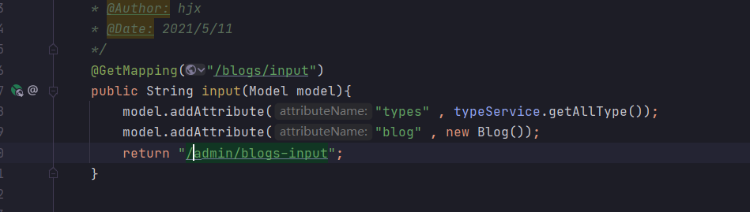
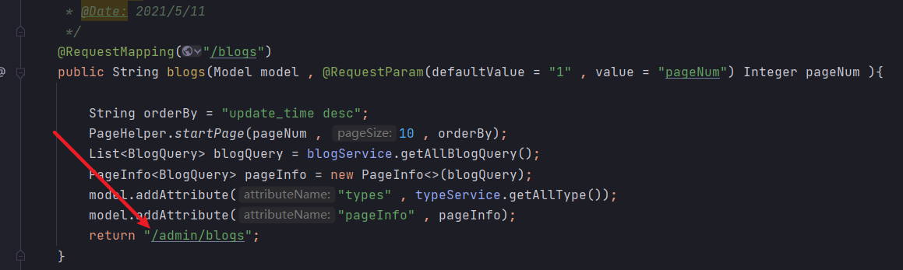

# 写博客的遇到的bug

## 1. 未识别的comment_count

``` java
org.springframework.jdbc.BadSqlGrammarException: 

### Error updating database.  Cause: java.sql.SQLSyntaxErrorException: Unknown column 'comment_count' in 'field list'

### The error may exist in file [D:\Java_project\IDEA\个人博客\myblog\target\classes\mapper\BlogMapper.xml]

### The error may involve com.hong.myblog.dao.BlogDao.saveBlog-Inline

### The error occurred while setting parameters

### SQL: insert into myblog.t_blog (id,title, content, first_picture, flag,                                    views, comment_count, appreciation, share_statement, commentabled, published,                                    recommend, create_time, update_time, type_id, user_id, description)         values (?,?,?,?,?,?,?,?,                 ?,?,?,?,?,                 ?,?,?,?);

### Cause: java.sql.SQLSyntaxErrorException: Unknown column 'comment_count' in 'field list'

; bad SQL grammar []; nested exception is java.sql.SQLSyntaxErrorException: Unknown column 'comment_count' in 'field list'
	at org.springframework.jdbc.support.SQLErrorCodeSQLExceptionTranslator.doTranslate(SQLErrorCodeSQLExceptionTranslator.java:239) ~[spring-jdbc-5.3.6.jar:5.3.6]
	at org.springframework.jdbc.support.AbstractFallbackSQLExceptionTranslator.translate(AbstractFallbackSQLExceptionTranslator.java:70) ~[spring-jdbc-5.3.6.jar:5.3.6]
	at org.mybatis.spring.MyBatisExceptionTranslator.translateExceptionIfPossible(MyBatisExceptionTranslator.java:88) ~[mybatis-spring-2.0.4.jar:2.0.4]
	at org.mybatis.spring.SqlSessionTemplate$SqlSessionInterceptor.invoke(SqlSessionTemplate.java:440) ~[mybatis-spring-2.0.4.jar:2.0.4]
	at com.sun.proxy.$Proxy73.insert(Unknown Source) ~[na:na]
	at org.mybatis.spring.SqlSessionTemplate.insert(SqlSessionTemplate.java:271) ~[mybatis-spring-2.0.4.jar:2.0.4]
	at org.apache.ibatis.binding.MapperMethod.execute(MapperMethod.java:62) ~[mybatis-3.5.4.jar:3.5.4]
	at org.apache.ibatis.binding.MapperProxy$PlainMethodInvoker.invoke(MapperProxy.java:144) ~[mybatis-3.5.4.jar:3.5.4]
	at org.apache.ibatis.binding.MapperProxy.invoke(MapperProxy.java:85) ~[mybatis-3.5.4.jar:3.5.4]
	at com.sun.proxy.$Proxy74.saveBlog(Unknown Source) ~[na:na]
	at java.base/jdk.internal.reflect.NativeMethodAccessorImpl.invoke0(Native Method) ~[na:na]
	at java.base/jdk.internal.reflect.NativeMethodAccessorImpl.invoke(NativeMethodAccessorImpl.java:62) ~[na:na]
	at java.base/jdk.internal.reflect.DelegatingMethodAccessorImpl.invoke(DelegatingMethodAccessorImpl.java:43) ~[na:na]
	at java.base/java.lang.reflect.Method.invoke(Method.java:564) ~[na:na]
	at org.springframework.aop.support.AopUtils.invokeJoinpointUsingReflection(AopUtils.java:344) ~[spring-aop-5.3.6.jar:5.3.6]
	at org.springframework.aop.framework.ReflectiveMethodInvocation.invokeJoinpoint(ReflectiveMethodInvocation.java:198) ~[spring-aop-5.3.6.jar:5.3.6]
	at org.springframework.aop.framework.ReflectiveMethodInvocation.proceed(ReflectiveMethodInvocation.java:163) ~[spring-aop-5.3.6.jar:5.3.6]
	at org.springframework.dao.support.PersistenceExceptionTranslationInterceptor.invoke(PersistenceExceptionTranslationInterceptor.java:137) ~[spring-tx-5.3.6.jar:5.3.6]
	at org.springframework.aop.framework.ReflectiveMethodInvocation.proceed(ReflectiveMethodInvocation.java:186) ~[spring-aop-5.3.6.jar:5.3.6]
	at org.springframework.aop.framework.JdkDynamicAopProxy.invoke(JdkDynamicAopProxy.java:215) ~[spring-aop-5.3.6.jar:5.3.6]
	at com.sun.proxy.$Proxy75.saveBlog(Unknown Source) ~[na:na]
	at com.hong.myblog.service.implement.BlogService_imp.saveBlog(BlogService_imp.java:30) ~[classes/:na]
	at com.hong.myblog.controller.admin.BlogController.post(BlogController.java:57) ~[classes/:na]
	at java.base/jdk.internal.reflect.NativeMethodAccessorImpl.invoke0(Native Method) ~[na:na]
	at java.base/jdk.internal.reflect.NativeMethodAccessorImpl.invoke(NativeMethodAccessorImpl.java:62) ~[na:na]
	at java.base/jdk.internal.reflect.DelegatingMethodAccessorImpl.invoke(DelegatingMethodAccessorImpl.java:43) ~[na:na]
	at java.base/java.lang.reflect.Method.invoke(Method.java:564) ~[na:na]
	at org.springframework.web.method.support.InvocableHandlerMethod.doInvoke(InvocableHandlerMethod.java:197) ~[spring-web-5.3.6.jar:5.3.6]
	at org.springframework.web.method.support.InvocableHandlerMethod.invokeForRequest(InvocableHandlerMethod.java:141) ~[spring-web-5.3.6.jar:5.3.6]
	at org.springframework.web.servlet.mvc.method.annotation.ServletInvocableHandlerMethod.invokeAndHandle(ServletInvocableHandlerMethod.java:106) ~[spring-webmvc-5.3.6.jar:5.3.6]
	at org.springframework.web.servlet.mvc.method.annotation.RequestMappingHandlerAdapter.invokeHandlerMethod(RequestMappingHandlerAdapter.java:894) ~[spring-webmvc-5.3.6.jar:5.3.6]
	at org.springframework.web.servlet.mvc.method.annotation.RequestMappingHandlerAdapter.handleInternal(RequestMappingHandlerAdapter.java:808) ~[spring-webmvc-5.3.6.jar:5.3.6]
	at org.springframework.web.servlet.mvc.method.AbstractHandlerMethodAdapter.handle(AbstractHandlerMethodAdapter.java:87) ~[spring-webmvc-5.3.6.jar:5.3.6]
	at org.springframework.web.servlet.DispatcherServlet.doDispatch(DispatcherServlet.java:1060) ~[spring-webmvc-5.3.6.jar:5.3.6]
	at org.springframework.web.servlet.DispatcherServlet.doService(DispatcherServlet.java:962) ~[spring-webmvc-5.3.6.jar:5.3.6]
	at org.springframework.web.servlet.FrameworkServlet.processRequest(FrameworkServlet.java:1006) ~[spring-webmvc-5.3.6.jar:5.3.6]
	at org.springframework.web.servlet.FrameworkServlet.doPost(FrameworkServlet.java:909) ~[spring-webmvc-5.3.6.jar:5.3.6]
	at javax.servlet.http.HttpServlet.service(HttpServlet.java:652) ~[tomcat-embed-core-9.0.45.jar:4.0.FR]
	at org.springframework.web.servlet.FrameworkServlet.service(FrameworkServlet.java:883) ~[spring-webmvc-5.3.6.jar:5.3.6]
	at javax.servlet.http.HttpServlet.service(HttpServlet.java:733) ~[tomcat-embed-core-9.0.45.jar:4.0.FR]
	at org.apache.catalina.core.ApplicationFilterChain.internalDoFilter(ApplicationFilterChain.java:227) ~[tomcat-embed-core-9.0.45.jar:9.0.45]
	at org.apache.catalina.core.ApplicationFilterChain.doFilter(ApplicationFilterChain.java:162) ~[tomcat-embed-core-9.0.45.jar:9.0.45]
	at org.apache.tomcat.websocket.server.WsFilter.doFilter(WsFilter.java:53) ~[tomcat-embed-websocket-9.0.45.jar:9.0.45]
	at org.apache.catalina.core.ApplicationFilterChain.internalDoFilter(ApplicationFilterChain.java:189) ~[tomcat-embed-core-9.0.45.jar:9.0.45]
	at org.apache.catalina.core.ApplicationFilterChain.doFilter(ApplicationFilterChain.java:162) ~[tomcat-embed-core-9.0.45.jar:9.0.45]
	at org.springframework.web.filter.RequestContextFilter.doFilterInternal(RequestContextFilter.java:100) ~[spring-web-5.3.6.jar:5.3.6]
	at org.springframework.web.filter.OncePerRequestFilter.doFilter(OncePerRequestFilter.java:119) ~[spring-web-5.3.6.jar:5.3.6]
	at org.apache.catalina.core.ApplicationFilterChain.internalDoFilter(ApplicationFilterChain.java:189) ~[tomcat-embed-core-9.0.45.jar:9.0.45]
	at org.apache.catalina.core.ApplicationFilterChain.doFilter(ApplicationFilterChain.java:162) ~[tomcat-embed-core-9.0.45.jar:9.0.45]
	at org.springframework.web.filter.FormContentFilter.doFilterInternal(FormContentFilter.java:93) ~[spring-web-5.3.6.jar:5.3.6]
	at org.springframework.web.filter.OncePerRequestFilter.doFilter(OncePerRequestFilter.java:119) ~[spring-web-5.3.6.jar:5.3.6]
	at org.apache.catalina.core.ApplicationFilterChain.internalDoFilter(ApplicationFilterChain.java:189) ~[tomcat-embed-core-9.0.45.jar:9.0.45]
	at org.apache.catalina.core.ApplicationFilterChain.doFilter(ApplicationFilterChain.java:162) ~[tomcat-embed-core-9.0.45.jar:9.0.45]
	at org.springframework.web.filter.CharacterEncodingFilter.doFilterInternal(CharacterEncodingFilter.java:201) ~[spring-web-5.3.6.jar:5.3.6]
	at org.springframework.web.filter.OncePerRequestFilter.doFilter(OncePerRequestFilter.java:119) ~[spring-web-5.3.6.jar:5.3.6]
	at org.apache.catalina.core.ApplicationFilterChain.internalDoFilter(ApplicationFilterChain.java:189) ~[tomcat-embed-core-9.0.45.jar:9.0.45]
	at org.apache.catalina.core.ApplicationFilterChain.doFilter(ApplicationFilterChain.java:162) ~[tomcat-embed-core-9.0.45.jar:9.0.45]
	at org.apache.catalina.core.StandardWrapperValve.invoke(StandardWrapperValve.java:202) ~[tomcat-embed-core-9.0.45.jar:9.0.45]
	at org.apache.catalina.core.StandardContextValve.invoke(StandardContextValve.java:97) ~[tomcat-embed-core-9.0.45.jar:9.0.45]
	at org.apache.catalina.authenticator.AuthenticatorBase.invoke(AuthenticatorBase.java:542) ~[tomcat-embed-core-9.0.45.jar:9.0.45]
	at org.apache.catalina.core.StandardHostValve.invoke(StandardHostValve.java:143) ~[tomcat-embed-core-9.0.45.jar:9.0.45]
	at org.apache.catalina.valves.ErrorReportValve.invoke(ErrorReportValve.java:92) ~[tomcat-embed-core-9.0.45.jar:9.0.45]
	at org.apache.catalina.core.StandardEngineValve.invoke(StandardEngineValve.java:78) ~[tomcat-embed-core-9.0.45.jar:9.0.45]
	at org.apache.catalina.connector.CoyoteAdapter.service(CoyoteAdapter.java:357) ~[tomcat-embed-core-9.0.45.jar:9.0.45]
	at org.apache.coyote.http11.Http11Processor.service(Http11Processor.java:374) ~[tomcat-embed-core-9.0.45.jar:9.0.45]
	at org.apache.coyote.AbstractProcessorLight.process(AbstractProcessorLight.java:65) ~[tomcat-embed-core-9.0.45.jar:9.0.45]
	at org.apache.coyote.AbstractProtocol$ConnectionHandler.process(AbstractProtocol.java:893) ~[tomcat-embed-core-9.0.45.jar:9.0.45]
	at org.apache.tomcat.util.net.NioEndpoint$SocketProcessor.doRun(NioEndpoint.java:1707) ~[tomcat-embed-core-9.0.45.jar:9.0.45]
	at org.apache.tomcat.util.net.SocketProcessorBase.run(SocketProcessorBase.java:49) ~[tomcat-embed-core-9.0.45.jar:9.0.45]
	at java.base/java.util.concurrent.ThreadPoolExecutor.runWorker(ThreadPoolExecutor.java:1130) ~[na:na]
	at java.base/java.util.concurrent.ThreadPoolExecutor$Worker.run(ThreadPoolExecutor.java:630) ~[na:na]
	at org.apache.tomcat.util.threads.TaskThread$WrappingRunnable.run(TaskThread.java:61) ~[tomcat-embed-core-9.0.45.jar:9.0.45]
	at java.base/java.lang.Thread.run(Thread.java:832) ~[na:na]
Caused by: java.sql.SQLSyntaxErrorException: Unknown column 'comment_count' in 'field list'
	at com.mysql.cj.jdbc.exceptions.SQLError.createSQLException(SQLError.java:120) ~[mysql-connector-java-8.0.23.jar:8.0.23]
	at com.mysql.cj.jdbc.exceptions.SQLExceptionsMapping.translateException(SQLExceptionsMapping.java:122) ~[mysql-connector-java-8.0.23.jar:8.0.23]
	at com.mysql.cj.jdbc.ClientPreparedStatement.executeInternal(ClientPreparedStatement.java:953) ~[mysql-connector-java-8.0.23.jar:8.0.23]
	at com.mysql.cj.jdbc.ClientPreparedStatement.execute(ClientPreparedStatement.java:370) ~[mysql-connector-java-8.0.23.jar:8.0.23]
	at com.zaxxer.hikari.pool.ProxyPreparedStatement.execute(ProxyPreparedStatement.java:44) ~[HikariCP-3.4.5.jar:na]
	at com.zaxxer.hikari.pool.HikariProxyPreparedStatement.execute(HikariProxyPreparedStatement.java) ~[HikariCP-3.4.5.jar:na]
	at java.base/jdk.internal.reflect.NativeMethodAccessorImpl.invoke0(Native Method) ~[na:na]
	at java.base/jdk.internal.reflect.NativeMethodAccessorImpl.invoke(NativeMethodAccessorImpl.java:62) ~[na:na]
	at java.base/jdk.internal.reflect.DelegatingMethodAccessorImpl.invoke(DelegatingMethodAccessorImpl.java:43) ~[na:na]
	at java.base/java.lang.reflect.Method.invoke(Method.java:564) ~[na:na]
	at org.apache.ibatis.logging.jdbc.PreparedStatementLogger.invoke(PreparedStatementLogger.java:59) ~[mybatis-3.5.4.jar:3.5.4]
	at com.sun.proxy.$Proxy109.execute(Unknown Source) ~[na:na]
	at org.apache.ibatis.executor.statement.PreparedStatementHandler.update(PreparedStatementHandler.java:47) ~[mybatis-3.5.4.jar:3.5.4]
	at org.apache.ibatis.executor.statement.RoutingStatementHandler.update(RoutingStatementHandler.java:74) ~[mybatis-3.5.4.jar:3.5.4]
	at org.apache.ibatis.executor.SimpleExecutor.doUpdate(SimpleExecutor.java:50) ~[mybatis-3.5.4.jar:3.5.4]
	at org.apache.ibatis.executor.BaseExecutor.update(BaseExecutor.java:117) ~[mybatis-3.5.4.jar:3.5.4]
	at org.apache.ibatis.executor.CachingExecutor.update(CachingExecutor.java:76) ~[mybatis-3.5.4.jar:3.5.4]
	at java.base/jdk.internal.reflect.NativeMethodAccessorImpl.invoke0(Native Method) ~[na:na]
	at java.base/jdk.internal.reflect.NativeMethodAccessorImpl.invoke(NativeMethodAccessorImpl.java:62) ~[na:na]
	at java.base/jdk.internal.reflect.DelegatingMethodAccessorImpl.invoke(DelegatingMethodAccessorImpl.java:43) ~[na:na]
	at java.base/java.lang.reflect.Method.invoke(Method.java:564) ~[na:na]
	at org.apache.ibatis.plugin.Plugin.invoke(Plugin.java:63) ~[mybatis-3.5.4.jar:3.5.4]
	at com.sun.proxy.$Proxy107.update(Unknown Source) ~[na:na]
	at org.apache.ibatis.session.defaults.DefaultSqlSession.update(DefaultSqlSession.java:197) ~[mybatis-3.5.4.jar:3.5.4]
	at org.apache.ibatis.session.defaults.DefaultSqlSession.insert(DefaultSqlSession.java:184) ~[mybatis-3.5.4.jar:3.5.4]
	at java.base/jdk.internal.reflect.NativeMethodAccessorImpl.invoke0(Native Method) ~[na:na]
	at java.base/jdk.internal.reflect.NativeMethodAccessorImpl.invoke(NativeMethodAccessorImpl.java:62) ~[na:na]
	at java.base/jdk.internal.reflect.DelegatingMethodAccessorImpl.invoke(DelegatingMethodAccessorImpl.java:43) ~[na:na]
	at java.base/java.lang.reflect.Method.invoke(Method.java:564) ~[na:na]
	at org.mybatis.spring.SqlSessionTemplate$SqlSessionInterceptor.invoke(SqlSessionTemplate.java:426) ~[mybatis-spring-2.0.4.jar:2.0.4]
	... 69 common frames omitted
```


解决方案：

发现数据库表中没有comment_count , comment_count表示浏览次数 需要在数据库添加comment_count

## 2. 请求无法传递json格式数据  

``` java
org.springframework.web.bind.MissingServletRequestParameterException: Required request parameter 'id' for method parameter type Long is not present
	at org.springframework.web.method.annotation.RequestParamMethodArgumentResolver.handleMissingValueInternal(RequestParamMethodArgumentResolver.java:218) ~[spring-web-5.3.6.jar:5.3.6]
	at org.springframework.web.method.annotation.RequestParamMethodArgumentResolver.handleMissingValue(RequestParamMethodArgumentResolver.java:193) ~[spring-web-5.3.6.jar:5.3.6]
	at org.springframework.web.method.annotation.AbstractNamedValueMethodArgumentResolver.resolveArgument(AbstractNamedValueMethodArgumentResolver.java:114) ~[spring-web-5.3.6.jar:5.3.6]
	at org.springframework.web.method.support.HandlerMethodArgumentResolverComposite.resolveArgument(HandlerMethodArgumentResolverComposite.java:121) ~[spring-web-5.3.6.jar:5.3.6]
	at org.springframework.web.method.support.InvocableHandlerMethod.getMethodArgumentValues(InvocableHandlerMethod.java:170) ~[spring-web-5.3.6.jar:5.3.6]
	at org.springframework.web.method.support.InvocableHandlerMethod.invokeForRequest(InvocableHandlerMethod.java:137) ~[spring-web-5.3.6.jar:5.3.6]
	at org.springframework.web.servlet.mvc.method.annotation.ServletInvocableHandlerMethod.invokeAndHandle(ServletInvocableHandlerMethod.java:106) ~[spring-webmvc-5.3.6.jar:5.3.6]
	at org.springframework.web.servlet.mvc.method.annotation.RequestMappingHandlerAdapter.invokeHandlerMethod(RequestMappingHandlerAdapter.java:894) ~[spring-webmvc-5.3.6.jar:5.3.6]
	at org.springframework.web.servlet.mvc.method.annotation.RequestMappingHandlerAdapter.handleInternal(RequestMappingHandlerAdapter.java:808) ~[spring-webmvc-5.3.6.jar:5.3.6]
	at org.springframework.web.servlet.mvc.method.AbstractHandlerMethodAdapter.handle(AbstractHandlerMethodAdapter.java:87) ~[spring-webmvc-5.3.6.jar:5.3.6]
	at org.springframework.web.servlet.DispatcherServlet.doDispatch(DispatcherServlet.java:1060) ~[spring-webmvc-5.3.6.jar:5.3.6]
	at org.springframework.web.servlet.DispatcherServlet.doService(DispatcherServlet.java:962) ~[spring-webmvc-5.3.6.jar:5.3.6]
	at org.springframework.web.servlet.FrameworkServlet.processRequest(FrameworkServlet.java:1006) ~[spring-webmvc-5.3.6.jar:5.3.6]
	at org.springframework.web.servlet.FrameworkServlet.doGet(FrameworkServlet.java:898) ~[spring-webmvc-5.3.6.jar:5.3.6]
	at javax.servlet.http.HttpServlet.service(HttpServlet.java:626) ~[tomcat-embed-core-9.0.45.jar:4.0.FR]
	at org.springframework.web.servlet.FrameworkServlet.service(FrameworkServlet.java:883) ~[spring-webmvc-5.3.6.jar:5.3.6]
	at javax.servlet.http.HttpServlet.service(HttpServlet.java:733) ~[tomcat-embed-core-9.0.45.jar:4.0.FR]
	at org.apache.catalina.core.ApplicationFilterChain.internalDoFilter(ApplicationFilterChain.java:227) ~[tomcat-embed-core-9.0.45.jar:9.0.45]
	at org.apache.catalina.core.ApplicationFilterChain.doFilter(ApplicationFilterChain.java:162) ~[tomcat-embed-core-9.0.45.jar:9.0.45]
	at org.apache.tomcat.websocket.server.WsFilter.doFilter(WsFilter.java:53) ~[tomcat-embed-websocket-9.0.45.jar:9.0.45]
	at org.apache.catalina.core.ApplicationFilterChain.internalDoFilter(ApplicationFilterChain.java:189) ~[tomcat-embed-core-9.0.45.jar:9.0.45]
	at org.apache.catalina.core.ApplicationFilterChain.doFilter(ApplicationFilterChain.java:162) ~[tomcat-embed-core-9.0.45.jar:9.0.45]
	at org.springframework.web.filter.RequestContextFilter.doFilterInternal(RequestContextFilter.java:100) ~[spring-web-5.3.6.jar:5.3.6]
	at org.springframework.web.filter.OncePerRequestFilter.doFilter(OncePerRequestFilter.java:119) ~[spring-web-5.3.6.jar:5.3.6]
	at org.apache.catalina.core.ApplicationFilterChain.internalDoFilter(ApplicationFilterChain.java:189) ~[tomcat-embed-core-9.0.45.jar:9.0.45]
	at org.apache.catalina.core.ApplicationFilterChain.doFilter(ApplicationFilterChain.java:162) ~[tomcat-embed-core-9.0.45.jar:9.0.45]
	at org.springframework.web.filter.FormContentFilter.doFilterInternal(FormContentFilter.java:93) ~[spring-web-5.3.6.jar:5.3.6]
	at org.springframework.web.filter.OncePerRequestFilter.doFilter(OncePerRequestFilter.java:119) ~[spring-web-5.3.6.jar:5.3.6]
	at org.apache.catalina.core.ApplicationFilterChain.internalDoFilter(ApplicationFilterChain.java:189) ~[tomcat-embed-core-9.0.45.jar:9.0.45]
	at org.apache.catalina.core.ApplicationFilterChain.doFilter(ApplicationFilterChain.java:162) ~[tomcat-embed-core-9.0.45.jar:9.0.45]
	at org.springframework.web.filter.CharacterEncodingFilter.doFilterInternal(CharacterEncodingFilter.java:201) ~[spring-web-5.3.6.jar:5.3.6]
	at org.springframework.web.filter.OncePerRequestFilter.doFilter(OncePerRequestFilter.java:119) ~[spring-web-5.3.6.jar:5.3.6]
	at org.apache.catalina.core.ApplicationFilterChain.internalDoFilter(ApplicationFilterChain.java:189) ~[tomcat-embed-core-9.0.45.jar:9.0.45]
	at org.apache.catalina.core.ApplicationFilterChain.doFilter(ApplicationFilterChain.java:162) ~[tomcat-embed-core-9.0.45.jar:9.0.45]
	at org.apache.catalina.core.StandardWrapperValve.invoke(StandardWrapperValve.java:202) ~[tomcat-embed-core-9.0.45.jar:9.0.45]
	at org.apache.catalina.core.StandardContextValve.invoke(StandardContextValve.java:97) ~[tomcat-embed-core-9.0.45.jar:9.0.45]
	at org.apache.catalina.authenticator.AuthenticatorBase.invoke(AuthenticatorBase.java:542) ~[tomcat-embed-core-9.0.45.jar:9.0.45]
	at org.apache.catalina.core.StandardHostValve.invoke(StandardHostValve.java:143) ~[tomcat-embed-core-9.0.45.jar:9.0.45]
	at org.apache.catalina.valves.ErrorReportValve.invoke(ErrorReportValve.java:92) ~[tomcat-embed-core-9.0.45.jar:9.0.45]
	at org.apache.catalina.core.StandardEngineValve.invoke(StandardEngineValve.java:78) ~[tomcat-embed-core-9.0.45.jar:9.0.45]
	at org.apache.catalina.connector.CoyoteAdapter.service(CoyoteAdapter.java:357) ~[tomcat-embed-core-9.0.45.jar:9.0.45]
	at org.apache.coyote.http11.Http11Processor.service(Http11Processor.java:374) ~[tomcat-embed-core-9.0.45.jar:9.0.45]
	at org.apache.coyote.AbstractProcessorLight.process(AbstractProcessorLight.java:65) ~[tomcat-embed-core-9.0.45.jar:9.0.45]
	at org.apache.coyote.AbstractProtocol$ConnectionHandler.process(AbstractProtocol.java:893) ~[tomcat-embed-core-9.0.45.jar:9.0.45]
	at org.apache.tomcat.util.net.NioEndpoint$SocketProcessor.doRun(NioEndpoint.java:1707) ~[tomcat-embed-core-9.0.45.jar:9.0.45]
	at org.apache.tomcat.util.net.SocketProcessorBase.run(SocketProcessorBase.java:49) ~[tomcat-embed-core-9.0.45.jar:9.0.45]
	at java.base/java.util.concurrent.ThreadPoolExecutor.runWorker(ThreadPoolExecutor.java:1130) ~[na:na]
	at java.base/java.util.concurrent.ThreadPoolExecutor$Worker.run(ThreadPoolExecutor.java:630) ~[na:na]
	at org.apache.tomcat.util.threads.TaskThread$WrappingRunnable.run(TaskThread.java:61) ~[tomcat-embed-core-9.0.45.jar:9.0.45]
	at java.base/java.lang.Thread.run(Thread.java:832) ~[na:na]

```


解决方案：参数写错了  

``` java
@RequestParam
```

```java
@PathVariable
```


`@RequestParam` 和 `@PathVariable` 注解是用于从request中接收请求的，两个都可以接收参数，关键点不同的是`@RequestParam` 是从request里面拿取值，而 `@PathVariable` 是从一个URI模板里面来填

```java
将@RequestParam改成@PathVariable 
```

@RequestParam和@PathVariable区别总结  https://blog.csdn.net/weixin_44745208/article/details/104467908

## 3 Post请求 URL重复

```java
org.springframework.beans.factory.BeanCreationException: Error creating bean with name 'requestMappingHandlerMapping' defined in class path resource [org/springframework/boot/autoconfigure/web/servlet/WebMvcAutoConfiguration$EnableWebMvcConfiguration.class]: Invocation of init method failed; nested exception is java.lang.IllegalStateException: Ambiguous mapping. Cannot map 'friendController' method 
com.hong.myblog.controller.admin.FriendController#editPost(FriendLink, RedirectAttributes)
to {POST [/admin/friendlinks]}: There is already 'friendController' bean method
com.hong.myblog.controller.admin.FriendController#post(FriendLink, RedirectAttributes) mapped.
	at org.springframework.beans.factory.support.AbstractAutowireCapableBeanFactory.initializeBean(AbstractAutowireCapableBeanFactory.java:1786) ~[spring-beans-5.3.6.jar:5.3.6]
	at org.springframework.beans.factory.support.AbstractAutowireCapableBeanFactory.doCreateBean(AbstractAutowireCapableBeanFactory.java:602) ~[spring-beans-5.3.6.jar:5.3.6]
	at org.springframework.beans.factory.support.AbstractAutowireCapableBeanFactory.createBean(AbstractAutowireCapableBeanFactory.java:524) ~[spring-beans-5.3.6.jar:5.3.6]
	at org.springframework.beans.factory.support.AbstractBeanFactory.lambda$doGetBean$0(AbstractBeanFactory.java:335) ~[spring-beans-5.3.6.jar:5.3.6]
	at org.springframework.beans.factory.support.DefaultSingletonBeanRegistry.getSingleton(DefaultSingletonBeanRegistry.java:234) ~[spring-beans-5.3.6.jar:5.3.6]
	at org.springframework.beans.factory.support.AbstractBeanFactory.doGetBean(AbstractBeanFactory.java:333) ~[spring-beans-5.3.6.jar:5.3.6]
	at org.springframework.beans.factory.support.AbstractBeanFactory.getBean(AbstractBeanFactory.java:208) ~[spring-beans-5.3.6.jar:5.3.6]
	at org.springframework.beans.factory.support.DefaultListableBeanFactory.preInstantiateSingletons(DefaultListableBeanFactory.java:944) ~[spring-beans-5.3.6.jar:5.3.6]
	at org.springframework.context.support.AbstractApplicationContext.finishBeanFactoryInitialization(AbstractApplicationContext.java:918) ~[spring-context-5.3.6.jar:5.3.6]
	at org.springframework.context.support.AbstractApplicationContext.refresh(AbstractApplicationContext.java:583) ~[spring-context-5.3.6.jar:5.3.6]
	at org.springframework.boot.web.servlet.context.ServletWebServerApplicationContext.refresh(ServletWebServerApplicationContext.java:144) ~[spring-boot-2.4.5.jar:2.4.5]
	at org.springframework.boot.SpringApplication.refresh(SpringApplication.java:782) ~[spring-boot-2.4.5.jar:2.4.5]
	at org.springframework.boot.SpringApplication.refresh(SpringApplication.java:774) ~[spring-boot-2.4.5.jar:2.4.5]
	at org.springframework.boot.SpringApplication.refreshContext(SpringApplication.java:439) ~[spring-boot-2.4.5.jar:2.4.5]
	at org.springframework.boot.SpringApplication.run(SpringApplication.java:339) ~[spring-boot-2.4.5.jar:2.4.5]
	at org.springframework.boot.SpringApplication.run(SpringApplication.java:1340) ~[spring-boot-2.4.5.jar:2.4.5]
	at org.springframework.boot.SpringApplication.run(SpringApplication.java:1329) ~[spring-boot-2.4.5.jar:2.4.5]
	at com.hong.myblog.MyblogApplication.main(MyblogApplication.java:10) ~[classes/:na]
	at java.base/jdk.internal.reflect.NativeMethodAccessorImpl.invoke0(Native Method) ~[na:na]
	at java.base/jdk.internal.reflect.NativeMethodAccessorImpl.invoke(NativeMethodAccessorImpl.java:62) ~[na:na]
	at java.base/jdk.internal.reflect.DelegatingMethodAccessorImpl.invoke(DelegatingMethodAccessorImpl.java:43) ~[na:na]
	at java.base/java.lang.reflect.Method.invoke(Method.java:564) ~[na:na]
	at org.springframework.boot.devtools.restart.RestartLauncher.run(RestartLauncher.java:49) ~[spring-boot-devtools-2.4.5.jar:2.4.5]
Caused by: java.lang.IllegalStateException: Ambiguous mapping. Cannot map 'friendController' method 
com.hong.myblog.controller.admin.FriendController#editPost(FriendLink, RedirectAttributes)
to {POST [/admin/friendlinks]}: There is already 'friendController' bean method
com.hong.myblog.controller.admin.FriendController#post(FriendLink, RedirectAttributes) mapped.
	at org.springframework.web.servlet.handler.AbstractHandlerMethodMapping$MappingRegistry.validateMethodMapping(AbstractHandlerMethodMapping.java:662) ~[spring-webmvc-5.3.6.jar:5.3.6]
	at org.springframework.web.servlet.handler.AbstractHandlerMethodMapping$MappingRegistry.register(AbstractHandlerMethodMapping.java:628) ~[spring-webmvc-5.3.6.jar:5.3.6]
	at org.springframework.web.servlet.handler.AbstractHandlerMethodMapping.registerHandlerMethod(AbstractHandlerMethodMapping.java:328) ~[spring-webmvc-5.3.6.jar:5.3.6]
	at org.springframework.web.servlet.mvc.method.annotation.RequestMappingHandlerMapping.registerHandlerMethod(RequestMappingHandlerMapping.java:395) ~[spring-webmvc-5.3.6.jar:5.3.6]
	at org.springframework.web.servlet.mvc.method.annotation.RequestMappingHandlerMapping.registerHandlerMethod(RequestMappingHandlerMapping.java:76) ~[spring-webmvc-5.3.6.jar:5.3.6]
	at org.springframework.web.servlet.handler.AbstractHandlerMethodMapping.lambda$detectHandlerMethods$2(AbstractHandlerMethodMapping.java:298) ~[spring-webmvc-5.3.6.jar:5.3.6]
	at java.base/java.util.LinkedHashMap.forEach(LinkedHashMap.java:723) ~[na:na]
	at org.springframework.web.servlet.handler.AbstractHandlerMethodMapping.detectHandlerMethods(AbstractHandlerMethodMapping.java:296) ~[spring-webmvc-5.3.6.jar:5.3.6]
	at org.springframework.web.servlet.handler.AbstractHandlerMethodMapping.processCandidateBean(AbstractHandlerMethodMapping.java:265) ~[spring-webmvc-5.3.6.jar:5.3.6]
	at org.springframework.web.servlet.handler.AbstractHandlerMethodMapping.initHandlerMethods(AbstractHandlerMethodMapping.java:224) ~[spring-webmvc-5.3.6.jar:5.3.6]
	at org.springframework.web.servlet.handler.AbstractHandlerMethodMapping.afterPropertiesSet(AbstractHandlerMethodMapping.java:212) ~[spring-webmvc-5.3.6.jar:5.3.6]
	at org.springframework.web.servlet.mvc.method.annotation.RequestMappingHandlerMapping.afterPropertiesSet(RequestMappingHandlerMapping.java:206) ~[spring-webmvc-5.3.6.jar:5.3.6]
	at org.springframework.beans.factory.support.AbstractAutowireCapableBeanFactory.invokeInitMethods(AbstractAutowireCapableBeanFactory.java:1845) ~[spring-beans-5.3.6.jar:5.3.6]
	at org.springframework.beans.factory.support.AbstractAutowireCapableBeanFactory.initializeBean(AbstractAutowireCapableBeanFactory.java:1782) ~[spring-beans-5.3.6.jar:5.3.6]
	... 22 common frames omitted

```


## 4modelAndView 视图层映射错误

```java
org.thymeleaf.exceptions.TemplateInputException: An error happened during template parsing (template: "class path resource [templates/admin/friendlinks.html]")
	at org.thymeleaf.templateparser.markup.AbstractMarkupTemplateParser.parse(AbstractMarkupTemplateParser.java:241) ~[thymeleaf-3.0.12.RELEASE.jar:3.0.12.RELEASE]
	at org.thymeleaf.templateparser.markup.AbstractMarkupTemplateParser.parseStandalone(AbstractMarkupTemplateParser.java:100) ~[thymeleaf-3.0.12.RELEASE.jar:3.0.12.RELEASE]
	at org.thymeleaf.engine.TemplateManager.parseAndProcess(TemplateManager.java:666) ~[thymeleaf-3.0.12.RELEASE.jar:3.0.12.RELEASE]
	at org.thymeleaf.TemplateEngine.process(TemplateEngine.java:1098) ~[thymeleaf-3.0.12.RELEASE.jar:3.0.12.RELEASE]
	at org.thymeleaf.TemplateEngine.process(TemplateEngine.java:1072) ~[thymeleaf-3.0.12.RELEASE.jar:3.0.12.RELEASE]
	at org.thymeleaf.spring5.view.ThymeleafView.renderFragment(ThymeleafView.java:366) ~[thymeleaf-spring5-3.0.12.RELEASE.jar:3.0.12.RELEASE]
	at org.thymeleaf.spring5.view.ThymeleafView.render(ThymeleafView.java:190) ~[thymeleaf-spring5-3.0.12.RELEASE.jar:3.0.12.RELEASE]
	at org.springframework.web.servlet.DispatcherServlet.render(DispatcherServlet.java:1393) ~[spring-webmvc-5.3.6.jar:5.3.6]
	at org.springframework.web.servlet.DispatcherServlet.processDispatchResult(DispatcherServlet.java:1138) ~[spring-webmvc-5.3.6.jar:5.3.6]
	at org.springframework.web.servlet.DispatcherServlet.doDispatch(DispatcherServlet.java:1077) ~[spring-webmvc-5.3.6.jar:5.3.6]
	at org.springframework.web.servlet.DispatcherServlet.doService(DispatcherServlet.java:962) ~[spring-webmvc-5.3.6.jar:5.3.6]
	at org.springframework.web.servlet.FrameworkServlet.processRequest(FrameworkServlet.java:1006) ~[spring-webmvc-5.3.6.jar:5.3.6]
	at org.springframework.web.servlet.FrameworkServlet.doGet(FrameworkServlet.java:898) ~[spring-webmvc-5.3.6.jar:5.3.6]
	at javax.servlet.http.HttpServlet.service(HttpServlet.java:626) ~[tomcat-embed-core-9.0.45.jar:4.0.FR]
	at org.springframework.web.servlet.FrameworkServlet.service(FrameworkServlet.java:883) ~[spring-webmvc-5.3.6.jar:5.3.6]
	at javax.servlet.http.HttpServlet.service(HttpServlet.java:733) ~[tomcat-embed-core-9.0.45.jar:4.0.FR]
	at org.apache.catalina.core.ApplicationFilterChain.internalDoFilter(ApplicationFilterChain.java:227) ~[tomcat-embed-core-9.0.45.jar:9.0.45]
	at org.apache.catalina.core.ApplicationFilterChain.doFilter(ApplicationFilterChain.java:162) ~[tomcat-embed-core-9.0.45.jar:9.0.45]
	at org.apache.tomcat.websocket.server.WsFilter.doFilter(WsFilter.java:53) ~[tomcat-embed-websocket-9.0.45.jar:9.0.45]
	at org.apache.catalina.core.ApplicationFilterChain.internalDoFilter(ApplicationFilterChain.java:189) ~[tomcat-embed-core-9.0.45.jar:9.0.45]
	at org.apache.catalina.core.ApplicationFilterChain.doFilter(ApplicationFilterChain.java:162) ~[tomcat-embed-core-9.0.45.jar:9.0.45]
	at org.springframework.web.filter.RequestContextFilter.doFilterInternal(RequestContextFilter.java:100) ~[spring-web-5.3.6.jar:5.3.6]
	at org.springframework.web.filter.OncePerRequestFilter.doFilter(OncePerRequestFilter.java:119) ~[spring-web-5.3.6.jar:5.3.6]
	at org.apache.catalina.core.ApplicationFilterChain.internalDoFilter(ApplicationFilterChain.java:189) ~[tomcat-embed-core-9.0.45.jar:9.0.45]
	at org.apache.catalina.core.ApplicationFilterChain.doFilter(ApplicationFilterChain.java:162) ~[tomcat-embed-core-9.0.45.jar:9.0.45]
	at org.springframework.web.filter.FormContentFilter.doFilterInternal(FormContentFilter.java:93) ~[spring-web-5.3.6.jar:5.3.6]
	at org.springframework.web.filter.OncePerRequestFilter.doFilter(OncePerRequestFilter.java:119) ~[spring-web-5.3.6.jar:5.3.6]
	at org.apache.catalina.core.ApplicationFilterChain.internalDoFilter(ApplicationFilterChain.java:189) ~[tomcat-embed-core-9.0.45.jar:9.0.45]
	at org.apache.catalina.core.ApplicationFilterChain.doFilter(ApplicationFilterChain.java:162) ~[tomcat-embed-core-9.0.45.jar:9.0.45]
	at org.springframework.web.filter.CharacterEncodingFilter.doFilterInternal(CharacterEncodingFilter.java:201) ~[spring-web-5.3.6.jar:5.3.6]
	at org.springframework.web.filter.OncePerRequestFilter.doFilter(OncePerRequestFilter.java:119) ~[spring-web-5.3.6.jar:5.3.6]
	at org.apache.catalina.core.ApplicationFilterChain.internalDoFilter(ApplicationFilterChain.java:189) ~[tomcat-embed-core-9.0.45.jar:9.0.45]
	at org.apache.catalina.core.ApplicationFilterChain.doFilter(ApplicationFilterChain.java:162) ~[tomcat-embed-core-9.0.45.jar:9.0.45]
	at org.apache.catalina.core.StandardWrapperValve.invoke(StandardWrapperValve.java:202) ~[tomcat-embed-core-9.0.45.jar:9.0.45]
	at org.apache.catalina.core.StandardContextValve.invoke(StandardContextValve.java:97) ~[tomcat-embed-core-9.0.45.jar:9.0.45]
	at org.apache.catalina.authenticator.AuthenticatorBase.invoke(AuthenticatorBase.java:542) ~[tomcat-embed-core-9.0.45.jar:9.0.45]
	at org.apache.catalina.core.StandardHostValve.invoke(StandardHostValve.java:143) ~[tomcat-embed-core-9.0.45.jar:9.0.45]
	at org.apache.catalina.valves.ErrorReportValve.invoke(ErrorReportValve.java:92) ~[tomcat-embed-core-9.0.45.jar:9.0.45]
	at org.apache.catalina.core.StandardEngineValve.invoke(StandardEngineValve.java:78) ~[tomcat-embed-core-9.0.45.jar:9.0.45]
	at org.apache.catalina.connector.CoyoteAdapter.service(CoyoteAdapter.java:357) ~[tomcat-embed-core-9.0.45.jar:9.0.45]
	at org.apache.coyote.http11.Http11Processor.service(Http11Processor.java:374) ~[tomcat-embed-core-9.0.45.jar:9.0.45]
	at org.apache.coyote.AbstractProcessorLight.process(AbstractProcessorLight.java:65) ~[tomcat-embed-core-9.0.45.jar:9.0.45]
	at org.apache.coyote.AbstractProtocol$ConnectionHandler.process(AbstractProtocol.java:893) ~[tomcat-embed-core-9.0.45.jar:9.0.45]
	at org.apache.tomcat.util.net.NioEndpoint$SocketProcessor.doRun(NioEndpoint.java:1707) ~[tomcat-embed-core-9.0.45.jar:9.0.45]
	at org.apache.tomcat.util.net.SocketProcessorBase.run(SocketProcessorBase.java:49) ~[tomcat-embed-core-9.0.45.jar:9.0.45]
	at java.base/java.util.concurrent.ThreadPoolExecutor.runWorker(ThreadPoolExecutor.java:1130) ~[na:na]
	at java.base/java.util.concurrent.ThreadPoolExecutor$Worker.run(ThreadPoolExecutor.java:630) ~[na:na]
	at org.apache.tomcat.util.threads.TaskThread$WrappingRunnable.run(TaskThread.java:61) ~[tomcat-embed-core-9.0.45.jar:9.0.45]
	at java.base/java.lang.Thread.run(Thread.java:832) ~[na:na]
Caused by: org.attoparser.ParseException: Exception evaluating SpringEL expression: "pageInfo.list" (template: "admin/friendlinks" - line 72, col 30)
	at org.attoparser.MarkupParser.parseDocument(MarkupParser.java:393) ~[attoparser-2.0.5.RELEASE.jar:2.0.5.RELEASE]
	at org.attoparser.MarkupParser.parse(MarkupParser.java:257) ~[attoparser-2.0.5.RELEASE.jar:2.0.5.RELEASE]
	at org.thymeleaf.templateparser.markup.AbstractMarkupTemplateParser.parse(AbstractMarkupTemplateParser.java:230) ~[thymeleaf-3.0.12.RELEASE.jar:3.0.12.RELEASE]
	... 48 common frames omitted
Caused by: org.thymeleaf.exceptions.TemplateProcessingException: Exception evaluating SpringEL expression: "pageInfo.list" (template: "admin/friendlinks" - line 72, col 30)
	at org.thymeleaf.spring5.expression.SPELVariableExpressionEvaluator.evaluate(SPELVariableExpressionEvaluator.java:292) ~[thymeleaf-spring5-3.0.12.RELEASE.jar:3.0.12.RELEASE]
	at org.thymeleaf.standard.expression.VariableExpression.executeVariableExpression(VariableExpression.java:166) ~[thymeleaf-3.0.12.RELEASE.jar:3.0.12.RELEASE]
	at org.thymeleaf.standard.expression.SimpleExpression.executeSimple(SimpleExpression.java:66) ~[thymeleaf-3.0.12.RELEASE.jar:3.0.12.RELEASE]
	at org.thymeleaf.standard.expression.Expression.execute(Expression.java:109) ~[thymeleaf-3.0.12.RELEASE.jar:3.0.12.RELEASE]
	at org.thymeleaf.standard.expression.Expression.execute(Expression.java:138) ~[thymeleaf-3.0.12.RELEASE.jar:3.0.12.RELEASE]
	at org.thymeleaf.standard.expression.Expression.execute(Expression.java:125) ~[thymeleaf-3.0.12.RELEASE.jar:3.0.12.RELEASE]
	at org.thymeleaf.standard.processor.StandardEachTagProcessor.doProcess(StandardEachTagProcessor.java:73) ~[thymeleaf-3.0.12.RELEASE.jar:3.0.12.RELEASE]
	at org.thymeleaf.processor.element.AbstractAttributeTagProcessor.doProcess(AbstractAttributeTagProcessor.java:74) ~[thymeleaf-3.0.12.RELEASE.jar:3.0.12.RELEASE]
	at org.thymeleaf.processor.element.AbstractElementTagProcessor.process(AbstractElementTagProcessor.java:95) ~[thymeleaf-3.0.12.RELEASE.jar:3.0.12.RELEASE]
	at org.thymeleaf.util.ProcessorConfigurationUtils$ElementTagProcessorWrapper.process(ProcessorConfigurationUtils.java:633) ~[thymeleaf-3.0.12.RELEASE.jar:3.0.12.RELEASE]
	at org.thymeleaf.engine.ProcessorTemplateHandler.handleOpenElement(ProcessorTemplateHandler.java:1314) ~[thymeleaf-3.0.12.RELEASE.jar:3.0.12.RELEASE]
	at org.thymeleaf.engine.TemplateHandlerAdapterMarkupHandler.handleOpenElementEnd(TemplateHandlerAdapterMarkupHandler.java:304) ~[thymeleaf-3.0.12.RELEASE.jar:3.0.12.RELEASE]
	at org.thymeleaf.templateparser.markup.InlinedOutputExpressionMarkupHandler$InlineMarkupAdapterPreProcessorHandler.handleOpenElementEnd(InlinedOutputExpressionMarkupHandler.java:278) ~[thymeleaf-3.0.12.RELEASE.jar:3.0.12.RELEASE]
	at org.thymeleaf.standard.inline.OutputExpressionInlinePreProcessorHandler.handleOpenElementEnd(OutputExpressionInlinePreProcessorHandler.java:186) ~[thymeleaf-3.0.12.RELEASE.jar:3.0.12.RELEASE]
	at org.thymeleaf.templateparser.markup.InlinedOutputExpressionMarkupHandler.handleOpenElementEnd(InlinedOutputExpressionMarkupHandler.java:124) ~[thymeleaf-3.0.12.RELEASE.jar:3.0.12.RELEASE]
	at org.attoparser.HtmlElement.handleOpenElementEnd(HtmlElement.java:109) ~[attoparser-2.0.5.RELEASE.jar:2.0.5.RELEASE]
	at org.attoparser.HtmlMarkupHandler.handleOpenElementEnd(HtmlMarkupHandler.java:297) ~[attoparser-2.0.5.RELEASE.jar:2.0.5.RELEASE]
	at org.attoparser.MarkupEventProcessorHandler.handleOpenElementEnd(MarkupEventProcessorHandler.java:402) ~[attoparser-2.0.5.RELEASE.jar:2.0.5.RELEASE]
	at org.attoparser.ParsingElementMarkupUtil.parseOpenElement(ParsingElementMarkupUtil.java:159) ~[attoparser-2.0.5.RELEASE.jar:2.0.5.RELEASE]
	at org.attoparser.MarkupParser.parseBuffer(MarkupParser.java:710) ~[attoparser-2.0.5.RELEASE.jar:2.0.5.RELEASE]
	at org.attoparser.MarkupParser.parseDocument(MarkupParser.java:301) ~[attoparser-2.0.5.RELEASE.jar:2.0.5.RELEASE]
	... 50 common frames omitted
Caused by: org.springframework.expression.spel.SpelEvaluationException: EL1007E: Property or field 'list' cannot be found on null
	at org.springframework.expression.spel.ast.PropertyOrFieldReference.readProperty(PropertyOrFieldReference.java:213) ~[spring-expression-5.3.6.jar:5.3.6]
	at org.springframework.expression.spel.ast.PropertyOrFieldReference.getValueInternal(PropertyOrFieldReference.java:104) ~[spring-expression-5.3.6.jar:5.3.6]
	at org.springframework.expression.spel.ast.PropertyOrFieldReference.access$000(PropertyOrFieldReference.java:51) ~[spring-expression-5.3.6.jar:5.3.6]
	at org.springframework.expression.spel.ast.PropertyOrFieldReference$AccessorLValue.getValue(PropertyOrFieldReference.java:406) ~[spring-expression-5.3.6.jar:5.3.6]
	at org.springframework.expression.spel.ast.CompoundExpression.getValueInternal(CompoundExpression.java:92) ~[spring-expression-5.3.6.jar:5.3.6]
	at org.springframework.expression.spel.ast.SpelNodeImpl.getValue(SpelNodeImpl.java:112) ~[spring-expression-5.3.6.jar:5.3.6]
	at org.springframework.expression.spel.standard.SpelExpression.getValue(SpelExpression.java:337) ~[spring-expression-5.3.6.jar:5.3.6]
	at org.thymeleaf.spring5.expression.SPELVariableExpressionEvaluator.evaluate(SPELVariableExpressionEvaluator.java:265) ~[thymeleaf-spring5-3.0.12.RELEASE.jar:3.0.12.RELEASE]
	... 70 common frames omitted

```


modelAndView 视图层属性不匹配 应该将第二张的page改成 pageInfo 或者将第一张 pageInfo 改成page

## 5 查找不到Template模板文件

```java
org.thymeleaf.exceptions.TemplateInputException: Error resolving template [admin/frinedlinks-input], template might not exist or might not be accessible by any of the configured Template Resolvers
	at org.thymeleaf.engine.TemplateManager.resolveTemplate(TemplateManager.java:869) ~[thymeleaf-3.0.12.RELEASE.jar:3.0.12.RELEASE]
	at org.thymeleaf.engine.TemplateManager.parseAndProcess(TemplateManager.java:607) ~[thymeleaf-3.0.12.RELEASE.jar:3.0.12.RELEASE]
	at org.thymeleaf.TemplateEngine.process(TemplateEngine.java:1098) ~[thymeleaf-3.0.12.RELEASE.jar:3.0.12.RELEASE]
	at org.thymeleaf.TemplateEngine.process(TemplateEngine.java:1072) ~[thymeleaf-3.0.12.RELEASE.jar:3.0.12.RELEASE]
	at org.thymeleaf.spring5.view.ThymeleafView.renderFragment(ThymeleafView.java:366) ~[thymeleaf-spring5-3.0.12.RELEASE.jar:3.0.12.RELEASE]
	at org.thymeleaf.spring5.view.ThymeleafView.render(ThymeleafView.java:190) ~[thymeleaf-spring5-3.0.12.RELEASE.jar:3.0.12.RELEASE]
	at org.springframework.web.servlet.DispatcherServlet.render(DispatcherServlet.java:1393) ~[spring-webmvc-5.3.6.jar:5.3.6]
	at org.springframework.web.servlet.DispatcherServlet.processDispatchResult(DispatcherServlet.java:1138) ~[spring-webmvc-5.3.6.jar:5.3.6]
	at org.springframework.web.servlet.DispatcherServlet.doDispatch(DispatcherServlet.java:1077) ~[spring-webmvc-5.3.6.jar:5.3.6]
	at org.springframework.web.servlet.DispatcherServlet.doService(DispatcherServlet.java:962) ~[spring-webmvc-5.3.6.jar:5.3.6]
	at org.springframework.web.servlet.FrameworkServlet.processRequest(FrameworkServlet.java:1006) ~[spring-webmvc-5.3.6.jar:5.3.6]
	at org.springframework.web.servlet.FrameworkServlet.doGet(FrameworkServlet.java:898) ~[spring-webmvc-5.3.6.jar:5.3.6]
	at javax.servlet.http.HttpServlet.service(HttpServlet.java:626) ~[tomcat-embed-core-9.0.45.jar:4.0.FR]
	at org.springframework.web.servlet.FrameworkServlet.service(FrameworkServlet.java:883) ~[spring-webmvc-5.3.6.jar:5.3.6]
	at javax.servlet.http.HttpServlet.service(HttpServlet.java:733) ~[tomcat-embed-core-9.0.45.jar:4.0.FR]
	at org.apache.catalina.core.ApplicationFilterChain.internalDoFilter(ApplicationFilterChain.java:227) ~[tomcat-embed-core-9.0.45.jar:9.0.45]
	at org.apache.catalina.core.ApplicationFilterChain.doFilter(ApplicationFilterChain.java:162) ~[tomcat-embed-core-9.0.45.jar:9.0.45]
	at org.apache.tomcat.websocket.server.WsFilter.doFilter(WsFilter.java:53) ~[tomcat-embed-websocket-9.0.45.jar:9.0.45]
	at org.apache.catalina.core.ApplicationFilterChain.internalDoFilter(ApplicationFilterChain.java:189) ~[tomcat-embed-core-9.0.45.jar:9.0.45]
	at org.apache.catalina.core.ApplicationFilterChain.doFilter(ApplicationFilterChain.java:162) ~[tomcat-embed-core-9.0.45.jar:9.0.45]
	at org.springframework.web.filter.RequestContextFilter.doFilterInternal(RequestContextFilter.java:100) ~[spring-web-5.3.6.jar:5.3.6]
	at org.springframework.web.filter.OncePerRequestFilter.doFilter(OncePerRequestFilter.java:119) ~[spring-web-5.3.6.jar:5.3.6]
	at org.apache.catalina.core.ApplicationFilterChain.internalDoFilter(ApplicationFilterChain.java:189) ~[tomcat-embed-core-9.0.45.jar:9.0.45]
	at org.apache.catalina.core.ApplicationFilterChain.doFilter(ApplicationFilterChain.java:162) ~[tomcat-embed-core-9.0.45.jar:9.0.45]
	at org.springframework.web.filter.FormContentFilter.doFilterInternal(FormContentFilter.java:93) ~[spring-web-5.3.6.jar:5.3.6]
	at org.springframework.web.filter.OncePerRequestFilter.doFilter(OncePerRequestFilter.java:119) ~[spring-web-5.3.6.jar:5.3.6]
	at org.apache.catalina.core.ApplicationFilterChain.internalDoFilter(ApplicationFilterChain.java:189) ~[tomcat-embed-core-9.0.45.jar:9.0.45]
	at org.apache.catalina.core.ApplicationFilterChain.doFilter(ApplicationFilterChain.java:162) ~[tomcat-embed-core-9.0.45.jar:9.0.45]
	at org.springframework.web.filter.CharacterEncodingFilter.doFilterInternal(CharacterEncodingFilter.java:201) ~[spring-web-5.3.6.jar:5.3.6]
	at org.springframework.web.filter.OncePerRequestFilter.doFilter(OncePerRequestFilter.java:119) ~[spring-web-5.3.6.jar:5.3.6]
	at org.apache.catalina.core.ApplicationFilterChain.internalDoFilter(ApplicationFilterChain.java:189) ~[tomcat-embed-core-9.0.45.jar:9.0.45]
	at org.apache.catalina.core.ApplicationFilterChain.doFilter(ApplicationFilterChain.java:162) ~[tomcat-embed-core-9.0.45.jar:9.0.45]
	at org.apache.catalina.core.StandardWrapperValve.invoke(StandardWrapperValve.java:202) ~[tomcat-embed-core-9.0.45.jar:9.0.45]
	at org.apache.catalina.core.StandardContextValve.invoke(StandardContextValve.java:97) ~[tomcat-embed-core-9.0.45.jar:9.0.45]
	at org.apache.catalina.authenticator.AuthenticatorBase.invoke(AuthenticatorBase.java:542) ~[tomcat-embed-core-9.0.45.jar:9.0.45]
	at org.apache.catalina.core.StandardHostValve.invoke(StandardHostValve.java:143) ~[tomcat-embed-core-9.0.45.jar:9.0.45]
	at org.apache.catalina.valves.ErrorReportValve.invoke(ErrorReportValve.java:92) ~[tomcat-embed-core-9.0.45.jar:9.0.45]
	at org.apache.catalina.core.StandardEngineValve.invoke(StandardEngineValve.java:78) ~[tomcat-embed-core-9.0.45.jar:9.0.45]
	at org.apache.catalina.connector.CoyoteAdapter.service(CoyoteAdapter.java:357) ~[tomcat-embed-core-9.0.45.jar:9.0.45]
	at org.apache.coyote.http11.Http11Processor.service(Http11Processor.java:374) ~[tomcat-embed-core-9.0.45.jar:9.0.45]
	at org.apache.coyote.AbstractProcessorLight.process(AbstractProcessorLight.java:65) ~[tomcat-embed-core-9.0.45.jar:9.0.45]
	at org.apache.coyote.AbstractProtocol$ConnectionHandler.process(AbstractProtocol.java:893) ~[tomcat-embed-core-9.0.45.jar:9.0.45]
	at org.apache.tomcat.util.net.NioEndpoint$SocketProcessor.doRun(NioEndpoint.java:1707) ~[tomcat-embed-core-9.0.45.jar:9.0.45]
	at org.apache.tomcat.util.net.SocketProcessorBase.run(SocketProcessorBase.java:49) ~[tomcat-embed-core-9.0.45.jar:9.0.45]
	at java.base/java.util.concurrent.ThreadPoolExecutor.runWorker(ThreadPoolExecutor.java:1130) ~[na:na]
	at java.base/java.util.concurrent.ThreadPoolExecutor$Worker.run(ThreadPoolExecutor.java:630) ~[na:na]
	at org.apache.tomcat.util.threads.TaskThread$WrappingRunnable.run(TaskThread.java:61) ~[tomcat-embed-core-9.0.45.jar:9.0.45]
	at java.base/java.lang.Thread.run(Thread.java:832) ~[na:na]

```


这个我不知道怎么回事 一模一样的但是没识别view  当我把第一个粘贴到这个 就没报错了 重写了一遍也没报错了  不知道怎么回事 

## 6 SQL语句错误

```
org.springframework.jdbc.BadSqlGrammarException: 
### Error updating database.  Cause: java.sql.SQLSyntaxErrorException: You have an error in your SQL syntax; check the manual that corresponds to your MySQL server version for the right syntax to use near 'blogname = 'Hong'pictureaddress = 'https://note.youdao.com/yws/api/personal/file' at line 1
### The error may exist in com/hong/myblog/dao/FriendLinkDao.java (best guess)
### The error may involve com.hong.myblog.dao.FriendLinkDao.updateFriendLink-Inline
### The error occurred while setting parameters
### SQL: update myblog.t_friend set blogaddress = ?blogname = ?pictureaddress = ?where id = ?
### Cause: java.sql.SQLSyntaxErrorException: You have an error in your SQL syntax; check the manual that corresponds to your MySQL server version for the right syntax to use near 'blogname = 'Hong'pictureaddress = 'https://note.youdao.com/yws/api/personal/file' at line 1
; bad SQL grammar []; nested exception is java.sql.SQLSyntaxErrorException: You have an error in your SQL syntax; check the manual that corresponds to your MySQL server version for the right syntax to use near 'blogname = 'Hong'pictureaddress = 'https://note.youdao.com/yws/api/personal/file' at line 1
	at org.springframework.jdbc.support.SQLErrorCodeSQLExceptionTranslator.doTranslate(SQLErrorCodeSQLExceptionTranslator.java:239) ~[spring-jdbc-5.3.6.jar:5.3.6]
	at org.springframework.jdbc.support.AbstractFallbackSQLExceptionTranslator.translate(AbstractFallbackSQLExceptionTranslator.java:70) ~[spring-jdbc-5.3.6.jar:5.3.6]
	at org.mybatis.spring.MyBatisExceptionTranslator.translateExceptionIfPossible(MyBatisExceptionTranslator.java:88) ~[mybatis-spring-2.0.4.jar:2.0.4]
	at org.mybatis.spring.SqlSessionTemplate$SqlSessionInterceptor.invoke(SqlSessionTemplate.java:440) ~[mybatis-spring-2.0.4.jar:2.0.4]
	at com.sun.proxy.$Proxy74.update(Unknown Source) ~[na:na]
	at org.mybatis.spring.SqlSessionTemplate.update(SqlSessionTemplate.java:287) ~[mybatis-spring-2.0.4.jar:2.0.4]
	at org.apache.ibatis.binding.MapperMethod.execute(MapperMethod.java:67) ~[mybatis-3.5.4.jar:3.5.4]
	at org.apache.ibatis.binding.MapperProxy$PlainMethodInvoker.invoke(MapperProxy.java:144) ~[mybatis-3.5.4.jar:3.5.4]
	at org.apache.ibatis.binding.MapperProxy.invoke(MapperProxy.java:85) ~[mybatis-3.5.4.jar:3.5.4]
	at com.sun.proxy.$Proxy83.updateFriendLink(Unknown Source) ~[na:na]
	at java.base/jdk.internal.reflect.NativeMethodAccessorImpl.invoke0(Native Method) ~[na:na]
	at java.base/jdk.internal.reflect.NativeMethodAccessorImpl.invoke(NativeMethodAccessorImpl.java:62) ~[na:na]
	at java.base/jdk.internal.reflect.DelegatingMethodAccessorImpl.invoke(DelegatingMethodAccessorImpl.java:43) ~[na:na]
	at java.base/java.lang.reflect.Method.invoke(Method.java:564) ~[na:na]
	at org.springframework.aop.support.AopUtils.invokeJoinpointUsingReflection(AopUtils.java:344) ~[spring-aop-5.3.6.jar:5.3.6]
	at org.springframework.aop.framework.ReflectiveMethodInvocation.invokeJoinpoint(ReflectiveMethodInvocation.java:198) ~[spring-aop-5.3.6.jar:5.3.6]
	at org.springframework.aop.framework.ReflectiveMethodInvocation.proceed(ReflectiveMethodInvocation.java:163) ~[spring-aop-5.3.6.jar:5.3.6]
	at org.springframework.dao.support.PersistenceExceptionTranslationInterceptor.invoke(PersistenceExceptionTranslationInterceptor.java:137) ~[spring-tx-5.3.6.jar:5.3.6]
	at org.springframework.aop.framework.ReflectiveMethodInvocation.proceed(ReflectiveMethodInvocation.java:186) ~[spring-aop-5.3.6.jar:5.3.6]
	at org.springframework.aop.framework.JdkDynamicAopProxy.invoke(JdkDynamicAopProxy.java:215) ~[spring-aop-5.3.6.jar:5.3.6]
	at com.sun.proxy.$Proxy84.updateFriendLink(Unknown Source) ~[na:na]
	at com.hong.myblog.service.implement.FriendService_imp.updateFriendLink(FriendService_imp.java:47) ~[classes/:na]
	at com.hong.myblog.controller.admin.FriendController.editPost(FriendController.java:81) ~[classes/:na]
	at java.base/jdk.internal.reflect.NativeMethodAccessorImpl.invoke0(Native Method) ~[na:na]
	at java.base/jdk.internal.reflect.NativeMethodAccessorImpl.invoke(NativeMethodAccessorImpl.java:62) ~[na:na]
	at java.base/jdk.internal.reflect.DelegatingMethodAccessorImpl.invoke(DelegatingMethodAccessorImpl.java:43) ~[na:na]
	at java.base/java.lang.reflect.Method.invoke(Method.java:564) ~[na:na]
	at org.springframework.web.method.support.InvocableHandlerMethod.doInvoke(InvocableHandlerMethod.java:197) ~[spring-web-5.3.6.jar:5.3.6]
	at org.springframework.web.method.support.InvocableHandlerMethod.invokeForRequest(InvocableHandlerMethod.java:141) ~[spring-web-5.3.6.jar:5.3.6]
	at org.springframework.web.servlet.mvc.method.annotation.ServletInvocableHandlerMethod.invokeAndHandle(ServletInvocableHandlerMethod.java:106) ~[spring-webmvc-5.3.6.jar:5.3.6]
	at org.springframework.web.servlet.mvc.method.annotation.RequestMappingHandlerAdapter.invokeHandlerMethod(RequestMappingHandlerAdapter.java:894) ~[spring-webmvc-5.3.6.jar:5.3.6]
	at org.springframework.web.servlet.mvc.method.annotation.RequestMappingHandlerAdapter.handleInternal(RequestMappingHandlerAdapter.java:808) ~[spring-webmvc-5.3.6.jar:5.3.6]
	at org.springframework.web.servlet.mvc.method.AbstractHandlerMethodAdapter.handle(AbstractHandlerMethodAdapter.java:87) ~[spring-webmvc-5.3.6.jar:5.3.6]
	at org.springframework.web.servlet.DispatcherServlet.doDispatch(DispatcherServlet.java:1060) ~[spring-webmvc-5.3.6.jar:5.3.6]
	at org.springframework.web.servlet.DispatcherServlet.doService(DispatcherServlet.java:962) ~[spring-webmvc-5.3.6.jar:5.3.6]
	at org.springframework.web.servlet.FrameworkServlet.processRequest(FrameworkServlet.java:1006) ~[spring-webmvc-5.3.6.jar:5.3.6]
	at org.springframework.web.servlet.FrameworkServlet.doPost(FrameworkServlet.java:909) ~[spring-webmvc-5.3.6.jar:5.3.6]
	at javax.servlet.http.HttpServlet.service(HttpServlet.java:652) ~[tomcat-embed-core-9.0.45.jar:4.0.FR]
	at org.springframework.web.servlet.FrameworkServlet.service(FrameworkServlet.java:883) ~[spring-webmvc-5.3.6.jar:5.3.6]
	at javax.servlet.http.HttpServlet.service(HttpServlet.java:733) ~[tomcat-embed-core-9.0.45.jar:4.0.FR]
	at org.apache.catalina.core.ApplicationFilterChain.internalDoFilter(ApplicationFilterChain.java:227) ~[tomcat-embed-core-9.0.45.jar:9.0.45]
	at org.apache.catalina.core.ApplicationFilterChain.doFilter(ApplicationFilterChain.java:162) ~[tomcat-embed-core-9.0.45.jar:9.0.45]
	at org.apache.tomcat.websocket.server.WsFilter.doFilter(WsFilter.java:53) ~[tomcat-embed-websocket-9.0.45.jar:9.0.45]
	at org.apache.catalina.core.ApplicationFilterChain.internalDoFilter(ApplicationFilterChain.java:189) ~[tomcat-embed-core-9.0.45.jar:9.0.45]
	at org.apache.catalina.core.ApplicationFilterChain.doFilter(ApplicationFilterChain.java:162) ~[tomcat-embed-core-9.0.45.jar:9.0.45]
	at org.springframework.web.filter.RequestContextFilter.doFilterInternal(RequestContextFilter.java:100) ~[spring-web-5.3.6.jar:5.3.6]
	at org.springframework.web.filter.OncePerRequestFilter.doFilter(OncePerRequestFilter.java:119) ~[spring-web-5.3.6.jar:5.3.6]
	at org.apache.catalina.core.ApplicationFilterChain.internalDoFilter(ApplicationFilterChain.java:189) ~[tomcat-embed-core-9.0.45.jar:9.0.45]
	at org.apache.catalina.core.ApplicationFilterChain.doFilter(ApplicationFilterChain.java:162) ~[tomcat-embed-core-9.0.45.jar:9.0.45]
	at org.springframework.web.filter.FormContentFilter.doFilterInternal(FormContentFilter.java:93) ~[spring-web-5.3.6.jar:5.3.6]
	at org.springframework.web.filter.OncePerRequestFilter.doFilter(OncePerRequestFilter.java:119) ~[spring-web-5.3.6.jar:5.3.6]
	at org.apache.catalina.core.ApplicationFilterChain.internalDoFilter(ApplicationFilterChain.java:189) ~[tomcat-embed-core-9.0.45.jar:9.0.45]
	at org.apache.catalina.core.ApplicationFilterChain.doFilter(ApplicationFilterChain.java:162) ~[tomcat-embed-core-9.0.45.jar:9.0.45]
	at org.springframework.web.filter.CharacterEncodingFilter.doFilterInternal(CharacterEncodingFilter.java:201) ~[spring-web-5.3.6.jar:5.3.6]
	at org.springframework.web.filter.OncePerRequestFilter.doFilter(OncePerRequestFilter.java:119) ~[spring-web-5.3.6.jar:5.3.6]
	at org.apache.catalina.core.ApplicationFilterChain.internalDoFilter(ApplicationFilterChain.java:189) ~[tomcat-embed-core-9.0.45.jar:9.0.45]
	at org.apache.catalina.core.ApplicationFilterChain.doFilter(ApplicationFilterChain.java:162) ~[tomcat-embed-core-9.0.45.jar:9.0.45]
	at org.apache.catalina.core.StandardWrapperValve.invoke(StandardWrapperValve.java:202) ~[tomcat-embed-core-9.0.45.jar:9.0.45]
	at org.apache.catalina.core.StandardContextValve.invoke(StandardContextValve.java:97) ~[tomcat-embed-core-9.0.45.jar:9.0.45]
	at org.apache.catalina.authenticator.AuthenticatorBase.invoke(AuthenticatorBase.java:542) ~[tomcat-embed-core-9.0.45.jar:9.0.45]
	at org.apache.catalina.core.StandardHostValve.invoke(StandardHostValve.java:143) ~[tomcat-embed-core-9.0.45.jar:9.0.45]
	at org.apache.catalina.valves.ErrorReportValve.invoke(ErrorReportValve.java:92) ~[tomcat-embed-core-9.0.45.jar:9.0.45]
	at org.apache.catalina.core.StandardEngineValve.invoke(StandardEngineValve.java:78) ~[tomcat-embed-core-9.0.45.jar:9.0.45]
	at org.apache.catalina.connector.CoyoteAdapter.service(CoyoteAdapter.java:357) ~[tomcat-embed-core-9.0.45.jar:9.0.45]
	at org.apache.coyote.http11.Http11Processor.service(Http11Processor.java:374) ~[tomcat-embed-core-9.0.45.jar:9.0.45]
	at org.apache.coyote.AbstractProcessorLight.process(AbstractProcessorLight.java:65) ~[tomcat-embed-core-9.0.45.jar:9.0.45]
	at org.apache.coyote.AbstractProtocol$ConnectionHandler.process(AbstractProtocol.java:893) ~[tomcat-embed-core-9.0.45.jar:9.0.45]
	at org.apache.tomcat.util.net.NioEndpoint$SocketProcessor.doRun(NioEndpoint.java:1707) ~[tomcat-embed-core-9.0.45.jar:9.0.45]
	at org.apache.tomcat.util.net.SocketProcessorBase.run(SocketProcessorBase.java:49) ~[tomcat-embed-core-9.0.45.jar:9.0.45]
	at java.base/java.util.concurrent.ThreadPoolExecutor.runWorker(ThreadPoolExecutor.java:1130) ~[na:na]
	at java.base/java.util.concurrent.ThreadPoolExecutor$Worker.run(ThreadPoolExecutor.java:630) ~[na:na]
	at org.apache.tomcat.util.threads.TaskThread$WrappingRunnable.run(TaskThread.java:61) ~[tomcat-embed-core-9.0.45.jar:9.0.45]
	at java.base/java.lang.Thread.run(Thread.java:832) ~[na:na]
Caused by: java.sql.SQLSyntaxErrorException: You have an error in your SQL syntax; check the manual that corresponds to your MySQL server version for the right syntax to use near 'blogname = 'Hong'pictureaddress = 'https://note.youdao.com/yws/api/personal/file' at line 1
	at com.mysql.cj.jdbc.exceptions.SQLError.createSQLException(SQLError.java:120) ~[mysql-connector-java-8.0.23.jar:8.0.23]
	at com.mysql.cj.jdbc.exceptions.SQLExceptionsMapping.translateException(SQLExceptionsMapping.java:122) ~[mysql-connector-java-8.0.23.jar:8.0.23]
	at com.mysql.cj.jdbc.ClientPreparedStatement.executeInternal(ClientPreparedStatement.java:953) ~[mysql-connector-java-8.0.23.jar:8.0.23]
	at com.mysql.cj.jdbc.ClientPreparedStatement.execute(ClientPreparedStatement.java:370) ~[mysql-connector-java-8.0.23.jar:8.0.23]
	at com.zaxxer.hikari.pool.ProxyPreparedStatement.execute(ProxyPreparedStatement.java:44) ~[HikariCP-3.4.5.jar:na]
	at com.zaxxer.hikari.pool.HikariProxyPreparedStatement.execute(HikariProxyPreparedStatement.java) ~[HikariCP-3.4.5.jar:na]
	at java.base/jdk.internal.reflect.NativeMethodAccessorImpl.invoke0(Native Method) ~[na:na]
	at java.base/jdk.internal.reflect.NativeMethodAccessorImpl.invoke(NativeMethodAccessorImpl.java:62) ~[na:na]
	at java.base/jdk.internal.reflect.DelegatingMethodAccessorImpl.invoke(DelegatingMethodAccessorImpl.java:43) ~[na:na]
	at java.base/java.lang.reflect.Method.invoke(Method.java:564) ~[na:na]
	at org.apache.ibatis.logging.jdbc.PreparedStatementLogger.invoke(PreparedStatementLogger.java:59) ~[mybatis-3.5.4.jar:3.5.4]
	at com.sun.proxy.$Proxy111.execute(Unknown Source) ~[na:na]
	at org.apache.ibatis.executor.statement.PreparedStatementHandler.update(PreparedStatementHandler.java:47) ~[mybatis-3.5.4.jar:3.5.4]
	at org.apache.ibatis.executor.statement.RoutingStatementHandler.update(RoutingStatementHandler.java:74) ~[mybatis-3.5.4.jar:3.5.4]
	at org.apache.ibatis.executor.SimpleExecutor.doUpdate(SimpleExecutor.java:50) ~[mybatis-3.5.4.jar:3.5.4]
	at org.apache.ibatis.executor.BaseExecutor.update(BaseExecutor.java:117) ~[mybatis-3.5.4.jar:3.5.4]
	at org.apache.ibatis.executor.CachingExecutor.update(CachingExecutor.java:76) ~[mybatis-3.5.4.jar:3.5.4]
	at java.base/jdk.internal.reflect.NativeMethodAccessorImpl.invoke0(Native Method) ~[na:na]
	at java.base/jdk.internal.reflect.NativeMethodAccessorImpl.invoke(NativeMethodAccessorImpl.java:62) ~[na:na]
	at java.base/jdk.internal.reflect.DelegatingMethodAccessorImpl.invoke(DelegatingMethodAccessorImpl.java:43) ~[na:na]
	at java.base/java.lang.reflect.Method.invoke(Method.java:564) ~[na:na]
	at org.apache.ibatis.plugin.Plugin.invoke(Plugin.java:63) ~[mybatis-3.5.4.jar:3.5.4]
	at com.sun.proxy.$Proxy109.update(Unknown Source) ~[na:na]
	at org.apache.ibatis.session.defaults.DefaultSqlSession.update(DefaultSqlSession.java:197) ~[mybatis-3.5.4.jar:3.5.4]
	at java.base/jdk.internal.reflect.NativeMethodAccessorImpl.invoke0(Native Method) ~[na:na]
	at java.base/jdk.internal.reflect.NativeMethodAccessorImpl.invoke(NativeMethodAccessorImpl.java:62) ~[na:na]
	at java.base/jdk.internal.reflect.DelegatingMethodAccessorImpl.invoke(DelegatingMethodAccessorImpl.java:43) ~[na:na]
	at java.base/java.lang.reflect.Method.invoke(Method.java:564) ~[na:na]
	at org.mybatis.spring.SqlSessionTemplate$SqlSessionInterceptor.invoke(SqlSessionTemplate.java:426) ~[mybatis-spring-2.0.4.jar:2.0.4]
	... 69 common frames omitted
```


## 7  类似4的错误  细节问题 传参字符段一定要一样

```java
org.thymeleaf.exceptions.TemplateInputException: An error happened during template parsing (template: "class path resource [templates/admin/pictures-input.html]")
	at org.thymeleaf.templateparser.markup.AbstractMarkupTemplateParser.parse(AbstractMarkupTemplateParser.java:241) ~[thymeleaf-3.0.12.RELEASE.jar:3.0.12.RELEASE]
	at org.thymeleaf.templateparser.markup.AbstractMarkupTemplateParser.parseStandalone(AbstractMarkupTemplateParser.java:100) ~[thymeleaf-3.0.12.RELEASE.jar:3.0.12.RELEASE]
	at org.thymeleaf.engine.TemplateManager.parseAndProcess(TemplateManager.java:666) ~[thymeleaf-3.0.12.RELEASE.jar:3.0.12.RELEASE]
	at org.thymeleaf.TemplateEngine.process(TemplateEngine.java:1098) ~[thymeleaf-3.0.12.RELEASE.jar:3.0.12.RELEASE]
	at org.thymeleaf.TemplateEngine.process(TemplateEngine.java:1072) ~[thymeleaf-3.0.12.RELEASE.jar:3.0.12.RELEASE]
	at org.thymeleaf.spring5.view.ThymeleafView.renderFragment(ThymeleafView.java:366) ~[thymeleaf-spring5-3.0.12.RELEASE.jar:3.0.12.RELEASE]
	at org.thymeleaf.spring5.view.ThymeleafView.render(ThymeleafView.java:190) ~[thymeleaf-spring5-3.0.12.RELEASE.jar:3.0.12.RELEASE]
	at org.springframework.web.servlet.DispatcherServlet.render(DispatcherServlet.java:1393) ~[spring-webmvc-5.3.6.jar:5.3.6]
	at org.springframework.web.servlet.DispatcherServlet.processDispatchResult(DispatcherServlet.java:1138) ~[spring-webmvc-5.3.6.jar:5.3.6]
	at org.springframework.web.servlet.DispatcherServlet.doDispatch(DispatcherServlet.java:1077) ~[spring-webmvc-5.3.6.jar:5.3.6]
	at org.springframework.web.servlet.DispatcherServlet.doService(DispatcherServlet.java:962) ~[spring-webmvc-5.3.6.jar:5.3.6]
	at org.springframework.web.servlet.FrameworkServlet.processRequest(FrameworkServlet.java:1006) ~[spring-webmvc-5.3.6.jar:5.3.6]
	at org.springframework.web.servlet.FrameworkServlet.doGet(FrameworkServlet.java:898) ~[spring-webmvc-5.3.6.jar:5.3.6]
	at javax.servlet.http.HttpServlet.service(HttpServlet.java:626) ~[tomcat-embed-core-9.0.45.jar:4.0.FR]
	at org.springframework.web.servlet.FrameworkServlet.service(FrameworkServlet.java:883) ~[spring-webmvc-5.3.6.jar:5.3.6]
	at javax.servlet.http.HttpServlet.service(HttpServlet.java:733) ~[tomcat-embed-core-9.0.45.jar:4.0.FR]
	at org.apache.catalina.core.ApplicationFilterChain.internalDoFilter(ApplicationFilterChain.java:227) ~[tomcat-embed-core-9.0.45.jar:9.0.45]
	at org.apache.catalina.core.ApplicationFilterChain.doFilter(ApplicationFilterChain.java:162) ~[tomcat-embed-core-9.0.45.jar:9.0.45]
	at org.apache.tomcat.websocket.server.WsFilter.doFilter(WsFilter.java:53) ~[tomcat-embed-websocket-9.0.45.jar:9.0.45]
	at org.apache.catalina.core.ApplicationFilterChain.internalDoFilter(ApplicationFilterChain.java:189) ~[tomcat-embed-core-9.0.45.jar:9.0.45]
	at org.apache.catalina.core.ApplicationFilterChain.doFilter(ApplicationFilterChain.java:162) ~[tomcat-embed-core-9.0.45.jar:9.0.45]
	at org.springframework.web.filter.RequestContextFilter.doFilterInternal(RequestContextFilter.java:100) ~[spring-web-5.3.6.jar:5.3.6]
	at org.springframework.web.filter.OncePerRequestFilter.doFilter(OncePerRequestFilter.java:119) ~[spring-web-5.3.6.jar:5.3.6]
	at org.apache.catalina.core.ApplicationFilterChain.internalDoFilter(ApplicationFilterChain.java:189) ~[tomcat-embed-core-9.0.45.jar:9.0.45]
	at org.apache.catalina.core.ApplicationFilterChain.doFilter(ApplicationFilterChain.java:162) ~[tomcat-embed-core-9.0.45.jar:9.0.45]
	at org.springframework.web.filter.FormContentFilter.doFilterInternal(FormContentFilter.java:93) ~[spring-web-5.3.6.jar:5.3.6]
	at org.springframework.web.filter.OncePerRequestFilter.doFilter(OncePerRequestFilter.java:119) ~[spring-web-5.3.6.jar:5.3.6]
	at org.apache.catalina.core.ApplicationFilterChain.internalDoFilter(ApplicationFilterChain.java:189) ~[tomcat-embed-core-9.0.45.jar:9.0.45]
	at org.apache.catalina.core.ApplicationFilterChain.doFilter(ApplicationFilterChain.java:162) ~[tomcat-embed-core-9.0.45.jar:9.0.45]
	at org.springframework.web.filter.CharacterEncodingFilter.doFilterInternal(CharacterEncodingFilter.java:201) ~[spring-web-5.3.6.jar:5.3.6]
	at org.springframework.web.filter.OncePerRequestFilter.doFilter(OncePerRequestFilter.java:119) ~[spring-web-5.3.6.jar:5.3.6]
	at org.apache.catalina.core.ApplicationFilterChain.internalDoFilter(ApplicationFilterChain.java:189) ~[tomcat-embed-core-9.0.45.jar:9.0.45]
	at org.apache.catalina.core.ApplicationFilterChain.doFilter(ApplicationFilterChain.java:162) ~[tomcat-embed-core-9.0.45.jar:9.0.45]
	at org.apache.catalina.core.StandardWrapperValve.invoke(StandardWrapperValve.java:202) ~[tomcat-embed-core-9.0.45.jar:9.0.45]
	at org.apache.catalina.core.StandardContextValve.invoke(StandardContextValve.java:97) ~[tomcat-embed-core-9.0.45.jar:9.0.45]
	at org.apache.catalina.authenticator.AuthenticatorBase.invoke(AuthenticatorBase.java:542) ~[tomcat-embed-core-9.0.45.jar:9.0.45]
	at org.apache.catalina.core.StandardHostValve.invoke(StandardHostValve.java:143) ~[tomcat-embed-core-9.0.45.jar:9.0.45]
	at org.apache.catalina.valves.ErrorReportValve.invoke(ErrorReportValve.java:92) ~[tomcat-embed-core-9.0.45.jar:9.0.45]
	at org.apache.catalina.core.StandardEngineValve.invoke(StandardEngineValve.java:78) ~[tomcat-embed-core-9.0.45.jar:9.0.45]
	at org.apache.catalina.connector.CoyoteAdapter.service(CoyoteAdapter.java:357) ~[tomcat-embed-core-9.0.45.jar:9.0.45]
	at org.apache.coyote.http11.Http11Processor.service(Http11Processor.java:374) ~[tomcat-embed-core-9.0.45.jar:9.0.45]
	at org.apache.coyote.AbstractProcessorLight.process(AbstractProcessorLight.java:65) ~[tomcat-embed-core-9.0.45.jar:9.0.45]
	at org.apache.coyote.AbstractProtocol$ConnectionHandler.process(AbstractProtocol.java:893) ~[tomcat-embed-core-9.0.45.jar:9.0.45]
	at org.apache.tomcat.util.net.NioEndpoint$SocketProcessor.doRun(NioEndpoint.java:1707) ~[tomcat-embed-core-9.0.45.jar:9.0.45]
	at org.apache.tomcat.util.net.SocketProcessorBase.run(SocketProcessorBase.java:49) ~[tomcat-embed-core-9.0.45.jar:9.0.45]
	at java.base/java.util.concurrent.ThreadPoolExecutor.runWorker(ThreadPoolExecutor.java:1130) ~[na:na]
	at java.base/java.util.concurrent.ThreadPoolExecutor$Worker.run(ThreadPoolExecutor.java:630) ~[na:na]
	at org.apache.tomcat.util.threads.TaskThread$WrappingRunnable.run(TaskThread.java:61) ~[tomcat-embed-core-9.0.45.jar:9.0.45]
	at java.base/java.lang.Thread.run(Thread.java:832) ~[na:na]
Caused by: org.attoparser.ParseException: Exception evaluating SpringEL expression: "id" (template: "admin/pictures-input" - line 55, col 38)
	at org.attoparser.MarkupParser.parseDocument(MarkupParser.java:393) ~[attoparser-2.0.5.RELEASE.jar:2.0.5.RELEASE]
	at org.attoparser.MarkupParser.parse(MarkupParser.java:257) ~[attoparser-2.0.5.RELEASE.jar:2.0.5.RELEASE]
	at org.thymeleaf.templateparser.markup.AbstractMarkupTemplateParser.parse(AbstractMarkupTemplateParser.java:230) ~[thymeleaf-3.0.12.RELEASE.jar:3.0.12.RELEASE]
	... 48 common frames omitted
Caused by: org.thymeleaf.exceptions.TemplateProcessingException: Exception evaluating SpringEL expression: "id" (template: "admin/pictures-input" - line 55, col 38)
	at org.thymeleaf.spring5.expression.SPELVariableExpressionEvaluator.evaluate(SPELVariableExpressionEvaluator.java:292) ~[thymeleaf-spring5-3.0.12.RELEASE.jar:3.0.12.RELEASE]
	at org.thymeleaf.standard.expression.SelectionVariableExpression.executeSelectionVariableExpression(SelectionVariableExpression.java:158) ~[thymeleaf-3.0.12.RELEASE.jar:3.0.12.RELEASE]
	at org.thymeleaf.standard.expression.SimpleExpression.executeSimple(SimpleExpression.java:92) ~[thymeleaf-3.0.12.RELEASE.jar:3.0.12.RELEASE]
	at org.thymeleaf.standard.expression.Expression.execute(Expression.java:109) ~[thymeleaf-3.0.12.RELEASE.jar:3.0.12.RELEASE]
	at org.thymeleaf.standard.expression.Expression.execute(Expression.java:138) ~[thymeleaf-3.0.12.RELEASE.jar:3.0.12.RELEASE]
	at org.thymeleaf.standard.expression.EqualsExpression.executeEquals(EqualsExpression.java:73) ~[thymeleaf-3.0.12.RELEASE.jar:3.0.12.RELEASE]
	at org.thymeleaf.standard.expression.ComplexExpression.executeComplex(ComplexExpression.java:95) ~[thymeleaf-3.0.12.RELEASE.jar:3.0.12.RELEASE]
	at org.thymeleaf.standard.expression.Expression.execute(Expression.java:112) ~[thymeleaf-3.0.12.RELEASE.jar:3.0.12.RELEASE]
	at org.thymeleaf.standard.expression.Expression.execute(Expression.java:138) ~[thymeleaf-3.0.12.RELEASE.jar:3.0.12.RELEASE]
	at org.thymeleaf.standard.expression.ConditionalExpression.executeConditional(ConditionalExpression.java:209) ~[thymeleaf-3.0.12.RELEASE.jar:3.0.12.RELEASE]
	at org.thymeleaf.standard.expression.ComplexExpression.executeComplex(ComplexExpression.java:77) ~[thymeleaf-3.0.12.RELEASE.jar:3.0.12.RELEASE]
	at org.thymeleaf.standard.expression.Expression.execute(Expression.java:112) ~[thymeleaf-3.0.12.RELEASE.jar:3.0.12.RELEASE]
	at org.thymeleaf.standard.expression.Expression.execute(Expression.java:138) ~[thymeleaf-3.0.12.RELEASE.jar:3.0.12.RELEASE]
	at org.thymeleaf.standard.processor.AbstractStandardExpressionAttributeTagProcessor.doProcess(AbstractStandardExpressionAttributeTagProcessor.java:144) ~[thymeleaf-3.0.12.RELEASE.jar:3.0.12.RELEASE]
	at org.thymeleaf.processor.element.AbstractAttributeTagProcessor.doProcess(AbstractAttributeTagProcessor.java:74) ~[thymeleaf-3.0.12.RELEASE.jar:3.0.12.RELEASE]
	at org.thymeleaf.processor.element.AbstractElementTagProcessor.process(AbstractElementTagProcessor.java:95) ~[thymeleaf-3.0.12.RELEASE.jar:3.0.12.RELEASE]
	at org.thymeleaf.util.ProcessorConfigurationUtils$ElementTagProcessorWrapper.process(ProcessorConfigurationUtils.java:633) ~[thymeleaf-3.0.12.RELEASE.jar:3.0.12.RELEASE]
	at org.thymeleaf.engine.ProcessorTemplateHandler.handleOpenElement(ProcessorTemplateHandler.java:1314) ~[thymeleaf-3.0.12.RELEASE.jar:3.0.12.RELEASE]
	at org.thymeleaf.engine.TemplateHandlerAdapterMarkupHandler.handleOpenElementEnd(TemplateHandlerAdapterMarkupHandler.java:304) ~[thymeleaf-3.0.12.RELEASE.jar:3.0.12.RELEASE]
	at org.thymeleaf.templateparser.markup.InlinedOutputExpressionMarkupHandler$InlineMarkupAdapterPreProcessorHandler.handleOpenElementEnd(InlinedOutputExpressionMarkupHandler.java:278) ~[thymeleaf-3.0.12.RELEASE.jar:3.0.12.RELEASE]
	at org.thymeleaf.standard.inline.OutputExpressionInlinePreProcessorHandler.handleOpenElementEnd(OutputExpressionInlinePreProcessorHandler.java:186) ~[thymeleaf-3.0.12.RELEASE.jar:3.0.12.RELEASE]
	at org.thymeleaf.templateparser.markup.InlinedOutputExpressionMarkupHandler.handleOpenElementEnd(InlinedOutputExpressionMarkupHandler.java:124) ~[thymeleaf-3.0.12.RELEASE.jar:3.0.12.RELEASE]
	at org.attoparser.HtmlElement.handleOpenElementEnd(HtmlElement.java:109) ~[attoparser-2.0.5.RELEASE.jar:2.0.5.RELEASE]
	at org.attoparser.HtmlMarkupHandler.handleOpenElementEnd(HtmlMarkupHandler.java:297) ~[attoparser-2.0.5.RELEASE.jar:2.0.5.RELEASE]
	at org.attoparser.MarkupEventProcessorHandler.handleOpenElementEnd(MarkupEventProcessorHandler.java:402) ~[attoparser-2.0.5.RELEASE.jar:2.0.5.RELEASE]
	at org.attoparser.ParsingElementMarkupUtil.parseOpenElement(ParsingElementMarkupUtil.java:159) ~[attoparser-2.0.5.RELEASE.jar:2.0.5.RELEASE]
	at org.attoparser.MarkupParser.parseBuffer(MarkupParser.java:710) ~[attoparser-2.0.5.RELEASE.jar:2.0.5.RELEASE]
	at org.attoparser.MarkupParser.parseDocument(MarkupParser.java:301) ~[attoparser-2.0.5.RELEASE.jar:2.0.5.RELEASE]
	... 50 common frames omitted
Caused by: org.springframework.expression.spel.SpelEvaluationException: EL1007E: Property or field 'id' cannot be found on null
	at org.springframework.expression.spel.ast.PropertyOrFieldReference.readProperty(PropertyOrFieldReference.java:213) ~[spring-expression-5.3.6.jar:5.3.6]
	at org.springframework.expression.spel.ast.PropertyOrFieldReference.getValueInternal(PropertyOrFieldReference.java:104) ~[spring-expression-5.3.6.jar:5.3.6]
	at org.springframework.expression.spel.ast.PropertyOrFieldReference.getValueInternal(PropertyOrFieldReference.java:91) ~[spring-expression-5.3.6.jar:5.3.6]
	at org.springframework.expression.spel.ast.SpelNodeImpl.getValue(SpelNodeImpl.java:112) ~[spring-expression-5.3.6.jar:5.3.6]
	at org.springframework.expression.spel.standard.SpelExpression.getValue(SpelExpression.java:337) ~[spring-expression-5.3.6.jar:5.3.6]
	at org.thymeleaf.spring5.expression.SPELVariableExpressionEvaluator.evaluate(SPELVariableExpressionEvaluator.java:265) ~[thymeleaf-spring5-3.0.12.RELEASE.jar:3.0.12.RELEASE]
	... 77 common frames omitted
```


## 8 提交网页404 


## 9 删除网页404


<u>注意 URL地址前后端一定要严格匹配 一样</u>

## 10 同9的低等错误 居然找了这么久 最后是通过自己写个字符串比较才找出来的


## 11 错误 首页无法显示

```java
org.thymeleaf.exceptions.TemplateInputException: An error happened during template parsing (template: "class path resource [templates/index.html]")
	at org.thymeleaf.templateparser.markup.AbstractMarkupTemplateParser.parse(AbstractMarkupTemplateParser.java:241) ~[thymeleaf-3.0.12.RELEASE.jar:3.0.12.RELEASE]
	at org.thymeleaf.templateparser.markup.AbstractMarkupTemplateParser.parseStandalone(AbstractMarkupTemplateParser.java:100) ~[thymeleaf-3.0.12.RELEASE.jar:3.0.12.RELEASE]
	at org.thymeleaf.engine.TemplateManager.parseAndProcess(TemplateManager.java:666) ~[thymeleaf-3.0.12.RELEASE.jar:3.0.12.RELEASE]
	at org.thymeleaf.TemplateEngine.process(TemplateEngine.java:1098) ~[thymeleaf-3.0.12.RELEASE.jar:3.0.12.RELEASE]
	at org.thymeleaf.TemplateEngine.process(TemplateEngine.java:1072) ~[thymeleaf-3.0.12.RELEASE.jar:3.0.12.RELEASE]
	at org.thymeleaf.spring5.view.ThymeleafView.renderFragment(ThymeleafView.java:366) ~[thymeleaf-spring5-3.0.12.RELEASE.jar:3.0.12.RELEASE]
	at org.thymeleaf.spring5.view.ThymeleafView.render(ThymeleafView.java:190) ~[thymeleaf-spring5-3.0.12.RELEASE.jar:3.0.12.RELEASE]
	at org.springframework.web.servlet.DispatcherServlet.render(DispatcherServlet.java:1393) ~[spring-webmvc-5.3.6.jar:5.3.6]
	at org.springframework.web.servlet.DispatcherServlet.processDispatchResult(DispatcherServlet.java:1138) ~[spring-webmvc-5.3.6.jar:5.3.6]
	at org.springframework.web.servlet.DispatcherServlet.doDispatch(DispatcherServlet.java:1077) ~[spring-webmvc-5.3.6.jar:5.3.6]
	at org.springframework.web.servlet.DispatcherServlet.doService(DispatcherServlet.java:962) ~[spring-webmvc-5.3.6.jar:5.3.6]
	at org.springframework.web.servlet.FrameworkServlet.processRequest(FrameworkServlet.java:1006) ~[spring-webmvc-5.3.6.jar:5.3.6]
	at org.springframework.web.servlet.FrameworkServlet.doGet(FrameworkServlet.java:898) ~[spring-webmvc-5.3.6.jar:5.3.6]
	at javax.servlet.http.HttpServlet.service(HttpServlet.java:626) ~[tomcat-embed-core-9.0.45.jar:4.0.FR]
	at org.springframework.web.servlet.FrameworkServlet.service(FrameworkServlet.java:883) ~[spring-webmvc-5.3.6.jar:5.3.6]
	at javax.servlet.http.HttpServlet.service(HttpServlet.java:733) ~[tomcat-embed-core-9.0.45.jar:4.0.FR]
	at org.apache.catalina.core.ApplicationFilterChain.internalDoFilter(ApplicationFilterChain.java:227) ~[tomcat-embed-core-9.0.45.jar:9.0.45]
	at org.apache.catalina.core.ApplicationFilterChain.doFilter(ApplicationFilterChain.java:162) ~[tomcat-embed-core-9.0.45.jar:9.0.45]
	at org.apache.tomcat.websocket.server.WsFilter.doFilter(WsFilter.java:53) ~[tomcat-embed-websocket-9.0.45.jar:9.0.45]
	at org.apache.catalina.core.ApplicationFilterChain.internalDoFilter(ApplicationFilterChain.java:189) ~[tomcat-embed-core-9.0.45.jar:9.0.45]
	at org.apache.catalina.core.ApplicationFilterChain.doFilter(ApplicationFilterChain.java:162) ~[tomcat-embed-core-9.0.45.jar:9.0.45]
	at org.springframework.web.filter.RequestContextFilter.doFilterInternal(RequestContextFilter.java:100) ~[spring-web-5.3.6.jar:5.3.6]
	at org.springframework.web.filter.OncePerRequestFilter.doFilter(OncePerRequestFilter.java:119) ~[spring-web-5.3.6.jar:5.3.6]
	at org.apache.catalina.core.ApplicationFilterChain.internalDoFilter(ApplicationFilterChain.java:189) ~[tomcat-embed-core-9.0.45.jar:9.0.45]
	at org.apache.catalina.core.ApplicationFilterChain.doFilter(ApplicationFilterChain.java:162) ~[tomcat-embed-core-9.0.45.jar:9.0.45]
	at org.springframework.web.filter.FormContentFilter.doFilterInternal(FormContentFilter.java:93) ~[spring-web-5.3.6.jar:5.3.6]
	at org.springframework.web.filter.OncePerRequestFilter.doFilter(OncePerRequestFilter.java:119) ~[spring-web-5.3.6.jar:5.3.6]
	at org.apache.catalina.core.ApplicationFilterChain.internalDoFilter(ApplicationFilterChain.java:189) ~[tomcat-embed-core-9.0.45.jar:9.0.45]
	at org.apache.catalina.core.ApplicationFilterChain.doFilter(ApplicationFilterChain.java:162) ~[tomcat-embed-core-9.0.45.jar:9.0.45]
	at org.springframework.web.filter.CharacterEncodingFilter.doFilterInternal(CharacterEncodingFilter.java:201) ~[spring-web-5.3.6.jar:5.3.6]
	at org.springframework.web.filter.OncePerRequestFilter.doFilter(OncePerRequestFilter.java:119) ~[spring-web-5.3.6.jar:5.3.6]
	at org.apache.catalina.core.ApplicationFilterChain.internalDoFilter(ApplicationFilterChain.java:189) ~[tomcat-embed-core-9.0.45.jar:9.0.45]
	at org.apache.catalina.core.ApplicationFilterChain.doFilter(ApplicationFilterChain.java:162) ~[tomcat-embed-core-9.0.45.jar:9.0.45]
	at org.apache.catalina.core.StandardWrapperValve.invoke(StandardWrapperValve.java:202) ~[tomcat-embed-core-9.0.45.jar:9.0.45]
	at org.apache.catalina.core.StandardContextValve.invoke(StandardContextValve.java:97) ~[tomcat-embed-core-9.0.45.jar:9.0.45]
	at org.apache.catalina.authenticator.AuthenticatorBase.invoke(AuthenticatorBase.java:542) ~[tomcat-embed-core-9.0.45.jar:9.0.45]
	at org.apache.catalina.core.StandardHostValve.invoke(StandardHostValve.java:143) ~[tomcat-embed-core-9.0.45.jar:9.0.45]
	at org.apache.catalina.valves.ErrorReportValve.invoke(ErrorReportValve.java:92) ~[tomcat-embed-core-9.0.45.jar:9.0.45]
	at org.apache.catalina.core.StandardEngineValve.invoke(StandardEngineValve.java:78) ~[tomcat-embed-core-9.0.45.jar:9.0.45]
	at org.apache.catalina.connector.CoyoteAdapter.service(CoyoteAdapter.java:357) ~[tomcat-embed-core-9.0.45.jar:9.0.45]
	at org.apache.coyote.http11.Http11Processor.service(Http11Processor.java:374) ~[tomcat-embed-core-9.0.45.jar:9.0.45]
	at org.apache.coyote.AbstractProcessorLight.process(AbstractProcessorLight.java:65) ~[tomcat-embed-core-9.0.45.jar:9.0.45]
	at org.apache.coyote.AbstractProtocol$ConnectionHandler.process(AbstractProtocol.java:893) ~[tomcat-embed-core-9.0.45.jar:9.0.45]
	at org.apache.tomcat.util.net.NioEndpoint$SocketProcessor.doRun(NioEndpoint.java:1707) ~[tomcat-embed-core-9.0.45.jar:9.0.45]
	at org.apache.tomcat.util.net.SocketProcessorBase.run(SocketProcessorBase.java:49) ~[tomcat-embed-core-9.0.45.jar:9.0.45]
	at java.base/java.util.concurrent.ThreadPoolExecutor.runWorker(ThreadPoolExecutor.java:1130) ~[na:na]
	at java.base/java.util.concurrent.ThreadPoolExecutor$Worker.run(ThreadPoolExecutor.java:630) ~[na:na]
	at org.apache.tomcat.util.threads.TaskThread$WrappingRunnable.run(TaskThread.java:61) ~[tomcat-embed-core-9.0.45.jar:9.0.45]
	at java.base/java.lang.Thread.run(Thread.java:832) ~[na:na]
Caused by: org.attoparser.ParseException: Exception evaluating SpringEL expression: "blog.avatar" (template: "index" - line 146, col 80)
	at org.attoparser.MarkupParser.parseDocument(MarkupParser.java:393) ~[attoparser-2.0.5.RELEASE.jar:2.0.5.RELEASE]
	at org.attoparser.MarkupParser.parse(MarkupParser.java:257) ~[attoparser-2.0.5.RELEASE.jar:2.0.5.RELEASE]
	at org.thymeleaf.templateparser.markup.AbstractMarkupTemplateParser.parse(AbstractMarkupTemplateParser.java:230) ~[thymeleaf-3.0.12.RELEASE.jar:3.0.12.RELEASE]
	... 48 common frames omitted
Caused by: org.thymeleaf.exceptions.TemplateProcessingException: Exception evaluating SpringEL expression: "blog.avatar" (template: "index" - line 146, col 80)
	at org.thymeleaf.spring5.expression.SPELVariableExpressionEvaluator.evaluate(SPELVariableExpressionEvaluator.java:292) ~[thymeleaf-spring5-3.0.12.RELEASE.jar:3.0.12.RELEASE]
	at org.thymeleaf.standard.expression.VariableExpression.executeVariableExpression(VariableExpression.java:166) ~[thymeleaf-3.0.12.RELEASE.jar:3.0.12.RELEASE]
	at org.thymeleaf.standard.expression.SimpleExpression.executeSimple(SimpleExpression.java:66) ~[thymeleaf-3.0.12.RELEASE.jar:3.0.12.RELEASE]
	at org.thymeleaf.standard.expression.Expression.execute(Expression.java:109) ~[thymeleaf-3.0.12.RELEASE.jar:3.0.12.RELEASE]
	at org.thymeleaf.standard.expression.Expression.execute(Expression.java:138) ~[thymeleaf-3.0.12.RELEASE.jar:3.0.12.RELEASE]
	at org.thymeleaf.standard.expression.LinkExpression.executeLinkExpression(LinkExpression.java:264) ~[thymeleaf-3.0.12.RELEASE.jar:3.0.12.RELEASE]
	at org.thymeleaf.standard.expression.SimpleExpression.executeSimple(SimpleExpression.java:85) ~[thymeleaf-3.0.12.RELEASE.jar:3.0.12.RELEASE]
	at org.thymeleaf.standard.expression.Expression.execute(Expression.java:109) ~[thymeleaf-3.0.12.RELEASE.jar:3.0.12.RELEASE]
	at org.thymeleaf.standard.expression.Expression.execute(Expression.java:138) ~[thymeleaf-3.0.12.RELEASE.jar:3.0.12.RELEASE]
	at org.thymeleaf.standard.processor.AbstractStandardExpressionAttributeTagProcessor.doProcess(AbstractStandardExpressionAttributeTagProcessor.java:144) ~[thymeleaf-3.0.12.RELEASE.jar:3.0.12.RELEASE]
	at org.thymeleaf.processor.element.AbstractAttributeTagProcessor.doProcess(AbstractAttributeTagProcessor.java:74) ~[thymeleaf-3.0.12.RELEASE.jar:3.0.12.RELEASE]
	at org.thymeleaf.processor.element.AbstractElementTagProcessor.process(AbstractElementTagProcessor.java:95) ~[thymeleaf-3.0.12.RELEASE.jar:3.0.12.RELEASE]
	at org.thymeleaf.util.ProcessorConfigurationUtils$ElementTagProcessorWrapper.process(ProcessorConfigurationUtils.java:633) ~[thymeleaf-3.0.12.RELEASE.jar:3.0.12.RELEASE]
	at org.thymeleaf.engine.ProcessorTemplateHandler.handleStandaloneElement(ProcessorTemplateHandler.java:918) ~[thymeleaf-3.0.12.RELEASE.jar:3.0.12.RELEASE]
	at org.thymeleaf.engine.StandaloneElementTag.beHandled(StandaloneElementTag.java:228) ~[thymeleaf-3.0.12.RELEASE.jar:3.0.12.RELEASE]
	at org.thymeleaf.engine.Model.process(Model.java:282) ~[thymeleaf-3.0.12.RELEASE.jar:3.0.12.RELEASE]
	at org.thymeleaf.engine.Model.process(Model.java:290) ~[thymeleaf-3.0.12.RELEASE.jar:3.0.12.RELEASE]
	at org.thymeleaf.engine.IteratedGatheringModelProcessable.processIterationModel(IteratedGatheringModelProcessable.java:367) ~[thymeleaf-3.0.12.RELEASE.jar:3.0.12.RELEASE]
	at org.thymeleaf.engine.IteratedGatheringModelProcessable.process(IteratedGatheringModelProcessable.java:221) ~[thymeleaf-3.0.12.RELEASE.jar:3.0.12.RELEASE]
	at org.thymeleaf.engine.ProcessorTemplateHandler.handleCloseElement(ProcessorTemplateHandler.java:1640) ~[thymeleaf-3.0.12.RELEASE.jar:3.0.12.RELEASE]
	at org.thymeleaf.engine.TemplateHandlerAdapterMarkupHandler.handleCloseElementEnd(TemplateHandlerAdapterMarkupHandler.java:388) ~[thymeleaf-3.0.12.RELEASE.jar:3.0.12.RELEASE]
	at org.thymeleaf.templateparser.markup.InlinedOutputExpressionMarkupHandler$InlineMarkupAdapterPreProcessorHandler.handleCloseElementEnd(InlinedOutputExpressionMarkupHandler.java:322) ~[thymeleaf-3.0.12.RELEASE.jar:3.0.12.RELEASE]
	at org.thymeleaf.standard.inline.OutputExpressionInlinePreProcessorHandler.handleCloseElementEnd(OutputExpressionInlinePreProcessorHandler.java:220) ~[thymeleaf-3.0.12.RELEASE.jar:3.0.12.RELEASE]
	at org.thymeleaf.templateparser.markup.InlinedOutputExpressionMarkupHandler.handleCloseElementEnd(InlinedOutputExpressionMarkupHandler.java:164) ~[thymeleaf-3.0.12.RELEASE.jar:3.0.12.RELEASE]
	at org.attoparser.HtmlElement.handleCloseElementEnd(HtmlElement.java:169) ~[attoparser-2.0.5.RELEASE.jar:2.0.5.RELEASE]
	at org.attoparser.HtmlMarkupHandler.handleCloseElementEnd(HtmlMarkupHandler.java:412) ~[attoparser-2.0.5.RELEASE.jar:2.0.5.RELEASE]
	at org.attoparser.MarkupEventProcessorHandler.handleCloseElementEnd(MarkupEventProcessorHandler.java:473) ~[attoparser-2.0.5.RELEASE.jar:2.0.5.RELEASE]
	at org.attoparser.ParsingElementMarkupUtil.parseCloseElement(ParsingElementMarkupUtil.java:201) ~[attoparser-2.0.5.RELEASE.jar:2.0.5.RELEASE]
	at org.attoparser.MarkupParser.parseBuffer(MarkupParser.java:725) ~[attoparser-2.0.5.RELEASE.jar:2.0.5.RELEASE]
	at org.attoparser.MarkupParser.parseDocument(MarkupParser.java:301) ~[attoparser-2.0.5.RELEASE.jar:2.0.5.RELEASE]
	... 50 common frames omitted
Caused by: org.springframework.expression.spel.SpelEvaluationException: EL1008E: Property or field 'avatar' cannot be found on object of type 'com.hong.myblog.entity.Blog' - maybe not public or not valid?
	at org.springframework.expression.spel.ast.PropertyOrFieldReference.readProperty(PropertyOrFieldReference.java:217) ~[spring-expression-5.3.6.jar:5.3.6]
	at org.springframework.expression.spel.ast.PropertyOrFieldReference.getValueInternal(PropertyOrFieldReference.java:104) ~[spring-expression-5.3.6.jar:5.3.6]
	at org.springframework.expression.spel.ast.PropertyOrFieldReference.access$000(PropertyOrFieldReference.java:51) ~[spring-expression-5.3.6.jar:5.3.6]
	at org.springframework.expression.spel.ast.PropertyOrFieldReference$AccessorLValue.getValue(PropertyOrFieldReference.java:406) ~[spring-expression-5.3.6.jar:5.3.6]
	at org.springframework.expression.spel.ast.CompoundExpression.getValueInternal(CompoundExpression.java:92) ~[spring-expression-5.3.6.jar:5.3.6]
	at org.springframework.expression.spel.ast.SpelNodeImpl.getValue(SpelNodeImpl.java:112) ~[spring-expression-5.3.6.jar:5.3.6]
	at org.springframework.expression.spel.standard.SpelExpression.getValue(SpelExpression.java:337) ~[spring-expression-5.3.6.jar:5.3.6]
	at org.thymeleaf.spring5.expression.SPELVariableExpressionEvaluator.evaluate(SPELVariableExpressionEvaluator.java:265) ~[thymeleaf-spring5-3.0.12.RELEASE.jar:3.0.12.RELEASE]
	... 79 common frames omitted
org.springframework.expression.spel.SpelEvaluationException: EL1008E: Property or field 'avatar' cannot be found on object of type 'com.hong.myblog.entity.Blog' - maybe not public or not valid?
	at org.springframework.expression.spel.ast.PropertyOrFieldReference.readProperty(PropertyOrFieldReference.java:217) ~[spring-expression-5.3.6.jar:5.3.6]
	at org.springframework.expression.spel.ast.PropertyOrFieldReference.getValueInternal(PropertyOrFieldReference.java:104) ~[spring-expression-5.3.6.jar:5.3.6]
	at org.springframework.expression.spel.ast.PropertyOrFieldReference.access$000(PropertyOrFieldReference.java:51) ~[spring-expression-5.3.6.jar:5.3.6]
	at org.springframework.expression.spel.ast.PropertyOrFieldReference$AccessorLValue.getValue(PropertyOrFieldReference.java:406) ~[spring-expression-5.3.6.jar:5.3.6]
	at org.springframework.expression.spel.ast.CompoundExpression.getValueInternal(CompoundExpression.java:92) ~[spring-expression-5.3.6.jar:5.3.6]
	at org.springframework.expression.spel.ast.SpelNodeImpl.getValue(SpelNodeImpl.java:112) ~[spring-expression-5.3.6.jar:5.3.6]
	at org.springframework.expression.spel.standard.SpelExpression.getValue(SpelExpression.java:337) ~[spring-expression-5.3.6.jar:5.3.6]
	at org.thymeleaf.spring5.expression.SPELVariableExpressionEvaluator.evaluate(SPELVariableExpressionEvaluator.java:265) ~[thymeleaf-spring5-3.0.12.RELEASE.jar:3.0.12.RELEASE]
	at org.thymeleaf.standard.expression.VariableExpression.executeVariableExpression(VariableExpression.java:166) ~[thymeleaf-3.0.12.RELEASE.jar:3.0.12.RELEASE]
	at org.thymeleaf.standard.expression.SimpleExpression.executeSimple(SimpleExpression.java:66) ~[thymeleaf-3.0.12.RELEASE.jar:3.0.12.RELEASE]
	at org.thymeleaf.standard.expression.Expression.execute(Expression.java:109) ~[thymeleaf-3.0.12.RELEASE.jar:3.0.12.RELEASE]
	at org.thymeleaf.standard.expression.Expression.execute(Expression.java:138) ~[thymeleaf-3.0.12.RELEASE.jar:3.0.12.RELEASE]
	at org.thymeleaf.standard.expression.LinkExpression.executeLinkExpression(LinkExpression.java:264) ~[thymeleaf-3.0.12.RELEASE.jar:3.0.12.RELEASE]
	at org.thymeleaf.standard.expression.SimpleExpression.executeSimple(SimpleExpression.java:85) ~[thymeleaf-3.0.12.RELEASE.jar:3.0.12.RELEASE]
	at org.thymeleaf.standard.expression.Expression.execute(Expression.java:109) ~[thymeleaf-3.0.12.RELEASE.jar:3.0.12.RELEASE]
	at org.thymeleaf.standard.expression.Expression.execute(Expression.java:138) ~[thymeleaf-3.0.12.RELEASE.jar:3.0.12.RELEASE]
	at org.thymeleaf.standard.processor.AbstractStandardExpressionAttributeTagProcessor.doProcess(AbstractStandardExpressionAttributeTagProcessor.java:144) ~[thymeleaf-3.0.12.RELEASE.jar:3.0.12.RELEASE]
	at org.thymeleaf.processor.element.AbstractAttributeTagProcessor.doProcess(AbstractAttributeTagProcessor.java:74) ~[thymeleaf-3.0.12.RELEASE.jar:3.0.12.RELEASE]
	at org.thymeleaf.processor.element.AbstractElementTagProcessor.process(AbstractElementTagProcessor.java:95) ~[thymeleaf-3.0.12.RELEASE.jar:3.0.12.RELEASE]
	at org.thymeleaf.util.ProcessorConfigurationUtils$ElementTagProcessorWrapper.process(ProcessorConfigurationUtils.java:633) ~[thymeleaf-3.0.12.RELEASE.jar:3.0.12.RELEASE]
	at org.thymeleaf.engine.ProcessorTemplateHandler.handleStandaloneElement(ProcessorTemplateHandler.java:918) ~[thymeleaf-3.0.12.RELEASE.jar:3.0.12.RELEASE]
	at org.thymeleaf.engine.StandaloneElementTag.beHandled(StandaloneElementTag.java:228) ~[thymeleaf-3.0.12.RELEASE.jar:3.0.12.RELEASE]
	at org.thymeleaf.engine.Model.process(Model.java:282) ~[thymeleaf-3.0.12.RELEASE.jar:3.0.12.RELEASE]
	at org.thymeleaf.engine.Model.process(Model.java:290) ~[thymeleaf-3.0.12.RELEASE.jar:3.0.12.RELEASE]
	at org.thymeleaf.engine.IteratedGatheringModelProcessable.processIterationModel(IteratedGatheringModelProcessable.java:367) ~[thymeleaf-3.0.12.RELEASE.jar:3.0.12.RELEASE]
	at org.thymeleaf.engine.IteratedGatheringModelProcessable.process(IteratedGatheringModelProcessable.java:221) ~[thymeleaf-3.0.12.RELEASE.jar:3.0.12.RELEASE]
	at org.thymeleaf.engine.ProcessorTemplateHandler.handleCloseElement(ProcessorTemplateHandler.java:1640) ~[thymeleaf-3.0.12.RELEASE.jar:3.0.12.RELEASE]
	at org.thymeleaf.engine.TemplateHandlerAdapterMarkupHandler.handleCloseElementEnd(TemplateHandlerAdapterMarkupHandler.java:388) ~[thymeleaf-3.0.12.RELEASE.jar:3.0.12.RELEASE]
	at org.thymeleaf.templateparser.markup.InlinedOutputExpressionMarkupHandler$InlineMarkupAdapterPreProcessorHandler.handleCloseElementEnd(InlinedOutputExpressionMarkupHandler.java:322) ~[thymeleaf-3.0.12.RELEASE.jar:3.0.12.RELEASE]
	at org.thymeleaf.standard.inline.OutputExpressionInlinePreProcessorHandler.handleCloseElementEnd(OutputExpressionInlinePreProcessorHandler.java:220) ~[thymeleaf-3.0.12.RELEASE.jar:3.0.12.RELEASE]
	at org.thymeleaf.templateparser.markup.InlinedOutputExpressionMarkupHandler.handleCloseElementEnd(InlinedOutputExpressionMarkupHandler.java:164) ~[thymeleaf-3.0.12.RELEASE.jar:3.0.12.RELEASE]
	at org.attoparser.HtmlElement.handleCloseElementEnd(HtmlElement.java:169) ~[attoparser-2.0.5.RELEASE.jar:2.0.5.RELEASE]
	at org.attoparser.HtmlMarkupHandler.handleCloseElementEnd(HtmlMarkupHandler.java:412) ~[attoparser-2.0.5.RELEASE.jar:2.0.5.RELEASE]
	at org.attoparser.MarkupEventProcessorHandler.handleCloseElementEnd(MarkupEventProcessorHandler.java:473) ~[attoparser-2.0.5.RELEASE.jar:2.0.5.RELEASE]
	at org.attoparser.ParsingElementMarkupUtil.parseCloseElement(ParsingElementMarkupUtil.java:201) ~[attoparser-2.0.5.RELEASE.jar:2.0.5.RELEASE]
	at org.attoparser.MarkupParser.parseBuffer(MarkupParser.java:725) ~[attoparser-2.0.5.RELEASE.jar:2.0.5.RELEASE]
	at org.attoparser.MarkupParser.parseDocument(MarkupParser.java:301) ~[attoparser-2.0.5.RELEASE.jar:2.0.5.RELEASE]
	at org.attoparser.MarkupParser.parse(MarkupParser.java:257) ~[attoparser-2.0.5.RELEASE.jar:2.0.5.RELEASE]
	at org.thymeleaf.templateparser.markup.AbstractMarkupTemplateParser.parse(AbstractMarkupTemplateParser.java:230) ~[thymeleaf-3.0.12.RELEASE.jar:3.0.12.RELEASE]
	at org.thymeleaf.templateparser.markup.AbstractMarkupTemplateParser.parseStandalone(AbstractMarkupTemplateParser.java:100) ~[thymeleaf-3.0.12.RELEASE.jar:3.0.12.RELEASE]
	at org.thymeleaf.engine.TemplateManager.parseAndProcess(TemplateManager.java:666) ~[thymeleaf-3.0.12.RELEASE.jar:3.0.12.RELEASE]
	at org.thymeleaf.TemplateEngine.process(TemplateEngine.java:1098) ~[thymeleaf-3.0.12.RELEASE.jar:3.0.12.RELEASE]
	at org.thymeleaf.TemplateEngine.process(TemplateEngine.java:1072) ~[thymeleaf-3.0.12.RELEASE.jar:3.0.12.RELEASE]
	at org.thymeleaf.spring5.view.ThymeleafView.renderFragment(ThymeleafView.java:366) ~[thymeleaf-spring5-3.0.12.RELEASE.jar:3.0.12.RELEASE]
	at org.thymeleaf.spring5.view.ThymeleafView.render(ThymeleafView.java:190) ~[thymeleaf-spring5-3.0.12.RELEASE.jar:3.0.12.RELEASE]
	at org.springframework.web.servlet.DispatcherServlet.render(DispatcherServlet.java:1393) ~[spring-webmvc-5.3.6.jar:5.3.6]
	at org.springframework.web.servlet.DispatcherServlet.processDispatchResult(DispatcherServlet.java:1138) ~[spring-webmvc-5.3.6.jar:5.3.6]
	at org.springframework.web.servlet.DispatcherServlet.doDispatch(DispatcherServlet.java:1077) ~[spring-webmvc-5.3.6.jar:5.3.6]
	at org.springframework.web.servlet.DispatcherServlet.doService(DispatcherServlet.java:962) ~[spring-webmvc-5.3.6.jar:5.3.6]
	at org.springframework.web.servlet.FrameworkServlet.processRequest(FrameworkServlet.java:1006) ~[spring-webmvc-5.3.6.jar:5.3.6]
	at org.springframework.web.servlet.FrameworkServlet.doGet(FrameworkServlet.java:898) ~[spring-webmvc-5.3.6.jar:5.3.6]
	at javax.servlet.http.HttpServlet.service(HttpServlet.java:626) ~[tomcat-embed-core-9.0.45.jar:4.0.FR]
	at org.springframework.web.servlet.FrameworkServlet.service(FrameworkServlet.java:883) ~[spring-webmvc-5.3.6.jar:5.3.6]
	at javax.servlet.http.HttpServlet.service(HttpServlet.java:733) ~[tomcat-embed-core-9.0.45.jar:4.0.FR]
	at org.apache.catalina.core.ApplicationFilterChain.internalDoFilter(ApplicationFilterChain.java:227) ~[tomcat-embed-core-9.0.45.jar:9.0.45]
	at org.apache.catalina.core.ApplicationFilterChain.doFilter(ApplicationFilterChain.java:162) ~[tomcat-embed-core-9.0.45.jar:9.0.45]
	at org.apache.tomcat.websocket.server.WsFilter.doFilter(WsFilter.java:53) ~[tomcat-embed-websocket-9.0.45.jar:9.0.45]
	at org.apache.catalina.core.ApplicationFilterChain.internalDoFilter(ApplicationFilterChain.java:189) ~[tomcat-embed-core-9.0.45.jar:9.0.45]
	at org.apache.catalina.core.ApplicationFilterChain.doFilter(ApplicationFilterChain.java:162) ~[tomcat-embed-core-9.0.45.jar:9.0.45]
	at org.springframework.web.filter.RequestContextFilter.doFilterInternal(RequestContextFilter.java:100) ~[spring-web-5.3.6.jar:5.3.6]
	at org.springframework.web.filter.OncePerRequestFilter.doFilter(OncePerRequestFilter.java:119) ~[spring-web-5.3.6.jar:5.3.6]
	at org.apache.catalina.core.ApplicationFilterChain.internalDoFilter(ApplicationFilterChain.java:189) ~[tomcat-embed-core-9.0.45.jar:9.0.45]
	at org.apache.catalina.core.ApplicationFilterChain.doFilter(ApplicationFilterChain.java:162) ~[tomcat-embed-core-9.0.45.jar:9.0.45]
	at org.springframework.web.filter.FormContentFilter.doFilterInternal(FormContentFilter.java:93) ~[spring-web-5.3.6.jar:5.3.6]
	at org.springframework.web.filter.OncePerRequestFilter.doFilter(OncePerRequestFilter.java:119) ~[spring-web-5.3.6.jar:5.3.6]
	at org.apache.catalina.core.ApplicationFilterChain.internalDoFilter(ApplicationFilterChain.java:189) ~[tomcat-embed-core-9.0.45.jar:9.0.45]
	at org.apache.catalina.core.ApplicationFilterChain.doFilter(ApplicationFilterChain.java:162) ~[tomcat-embed-core-9.0.45.jar:9.0.45]
	at org.springframework.web.filter.CharacterEncodingFilter.doFilterInternal(CharacterEncodingFilter.java:201) ~[spring-web-5.3.6.jar:5.3.6]
	at org.springframework.web.filter.OncePerRequestFilter.doFilter(OncePerRequestFilter.java:119) ~[spring-web-5.3.6.jar:5.3.6]
	at org.apache.catalina.core.ApplicationFilterChain.internalDoFilter(ApplicationFilterChain.java:189) ~[tomcat-embed-core-9.0.45.jar:9.0.45]
	at org.apache.catalina.core.ApplicationFilterChain.doFilter(ApplicationFilterChain.java:162) ~[tomcat-embed-core-9.0.45.jar:9.0.45]
	at org.apache.catalina.core.StandardWrapperValve.invoke(StandardWrapperValve.java:202) ~[tomcat-embed-core-9.0.45.jar:9.0.45]
	at org.apache.catalina.core.StandardContextValve.invoke(StandardContextValve.java:97) ~[tomcat-embed-core-9.0.45.jar:9.0.45]
	at org.apache.catalina.authenticator.AuthenticatorBase.invoke(AuthenticatorBase.java:542) ~[tomcat-embed-core-9.0.45.jar:9.0.45]
	at org.apache.catalina.core.StandardHostValve.invoke(StandardHostValve.java:143) ~[tomcat-embed-core-9.0.45.jar:9.0.45]
	at org.apache.catalina.valves.ErrorReportValve.invoke(ErrorReportValve.java:92) ~[tomcat-embed-core-9.0.45.jar:9.0.45]
	at org.apache.catalina.core.StandardEngineValve.invoke(StandardEngineValve.java:78) ~[tomcat-embed-core-9.0.45.jar:9.0.45]
	at org.apache.catalina.connector.CoyoteAdapter.service(CoyoteAdapter.java:357) ~[tomcat-embed-core-9.0.45.jar:9.0.45]
	at org.apache.coyote.http11.Http11Processor.service(Http11Processor.java:374) ~[tomcat-embed-core-9.0.45.jar:9.0.45]
	at org.apache.coyote.AbstractProcessorLight.process(AbstractProcessorLight.java:65) ~[tomcat-embed-core-9.0.45.jar:9.0.45]
	at org.apache.coyote.AbstractProtocol$ConnectionHandler.process(AbstractProtocol.java:893) ~[tomcat-embed-core-9.0.45.jar:9.0.45]
	at org.apache.tomcat.util.net.NioEndpoint$SocketProcessor.doRun(NioEndpoint.java:1707) ~[tomcat-embed-core-9.0.45.jar:9.0.45]
	at org.apache.tomcat.util.net.SocketProcessorBase.run(SocketProcessorBase.java:49) ~[tomcat-embed-core-9.0.45.jar:9.0.45]
	at java.base/java.util.concurrent.ThreadPoolExecutor.runWorker(ThreadPoolExecutor.java:1130) ~[na:na]
	at java.base/java.util.concurrent.ThreadPoolExecutor$Worker.run(ThreadPoolExecutor.java:630) ~[na:na]
	at org.apache.tomcat.util.threads.TaskThread$WrappingRunnable.run(TaskThread.java:61) ~[tomcat-embed-core-9.0.45.jar:9.0.45]
	at java.base/java.lang.Thread.run(Thread.java:832) ~[na:na]
```


## 12 数据库语句错误

```java
org.springframework.jdbc.BadSqlGrammarException: 
### Error updating database.  Cause: java.sql.SQLSyntaxErrorException: You have an error in your SQL syntax; check the manual that corresponds to your MySQL server version for the right syntax to use near '' at line 1
### The error may exist in com/hong/myblog/dao/TypeDao.java (best guess)
### The error may involve com.hong.myblog.dao.TypeDao.saveType-Inline
### The error occurred while setting parameters
### SQL: insert into myblog.type values (?,?
### Cause: java.sql.SQLSyntaxErrorException: You have an error in your SQL syntax; check the manual that corresponds to your MySQL server version for the right syntax to use near '' at line 1
; bad SQL grammar []; nested exception is java.sql.SQLSyntaxErrorException: You have an error in your SQL syntax; check the manual that corresponds to your MySQL server version for the right syntax to use near '' at line 1
	at org.springframework.jdbc.support.SQLErrorCodeSQLExceptionTranslator.doTranslate(SQLErrorCodeSQLExceptionTranslator.java:239) ~[spring-jdbc-5.3.6.jar:5.3.6]
	at org.springframework.jdbc.support.AbstractFallbackSQLExceptionTranslator.translate(AbstractFallbackSQLExceptionTranslator.java:70) ~[spring-jdbc-5.3.6.jar:5.3.6]
	at org.mybatis.spring.MyBatisExceptionTranslator.translateExceptionIfPossible(MyBatisExceptionTranslator.java:88) ~[mybatis-spring-2.0.4.jar:2.0.4]
	at org.mybatis.spring.SqlSessionTemplate$SqlSessionInterceptor.invoke(SqlSessionTemplate.java:440) ~[mybatis-spring-2.0.4.jar:2.0.4]
	at com.sun.proxy.$Proxy75.insert(Unknown Source) ~[na:na]
	at org.mybatis.spring.SqlSessionTemplate.insert(SqlSessionTemplate.java:271) ~[mybatis-spring-2.0.4.jar:2.0.4]
	at org.apache.ibatis.binding.MapperMethod.execute(MapperMethod.java:62) ~[mybatis-3.5.4.jar:3.5.4]
	at org.apache.ibatis.binding.MapperProxy$PlainMethodInvoker.invoke(MapperProxy.java:144) ~[mybatis-3.5.4.jar:3.5.4]
	at org.apache.ibatis.binding.MapperProxy.invoke(MapperProxy.java:85) ~[mybatis-3.5.4.jar:3.5.4]
	at com.sun.proxy.$Proxy87.saveType(Unknown Source) ~[na:na]
	at java.base/jdk.internal.reflect.NativeMethodAccessorImpl.invoke0(Native Method) ~[na:na]
	at java.base/jdk.internal.reflect.NativeMethodAccessorImpl.invoke(NativeMethodAccessorImpl.java:62) ~[na:na]
	at java.base/jdk.internal.reflect.DelegatingMethodAccessorImpl.invoke(DelegatingMethodAccessorImpl.java:43) ~[na:na]
	at java.base/java.lang.reflect.Method.invoke(Method.java:564) ~[na:na]
	at org.springframework.aop.support.AopUtils.invokeJoinpointUsingReflection(AopUtils.java:344) ~[spring-aop-5.3.6.jar:5.3.6]
	at org.springframework.aop.framework.ReflectiveMethodInvocation.invokeJoinpoint(ReflectiveMethodInvocation.java:198) ~[spring-aop-5.3.6.jar:5.3.6]
	at org.springframework.aop.framework.ReflectiveMethodInvocation.proceed(ReflectiveMethodInvocation.java:163) ~[spring-aop-5.3.6.jar:5.3.6]
	at org.springframework.dao.support.PersistenceExceptionTranslationInterceptor.invoke(PersistenceExceptionTranslationInterceptor.java:137) ~[spring-tx-5.3.6.jar:5.3.6]
	at org.springframework.aop.framework.ReflectiveMethodInvocation.proceed(ReflectiveMethodInvocation.java:186) ~[spring-aop-5.3.6.jar:5.3.6]
	at org.springframework.aop.framework.JdkDynamicAopProxy.invoke(JdkDynamicAopProxy.java:215) ~[spring-aop-5.3.6.jar:5.3.6]
	at com.sun.proxy.$Proxy88.saveType(Unknown Source) ~[na:na]
	at com.hong.myblog.service.Implement.TypeService_imp.saveType(TypeService_imp.java:28) ~[classes/:na]
	at com.hong.myblog.service.Implement.TypeService_imp$$FastClassBySpringCGLIB$$ae695785.invoke(<generated>) ~[classes/:na]
	at org.springframework.cglib.proxy.MethodProxy.invoke(MethodProxy.java:218) ~[spring-core-5.3.6.jar:5.3.6]
	at org.springframework.aop.framework.CglibAopProxy$CglibMethodInvocation.invokeJoinpoint(CglibAopProxy.java:779) ~[spring-aop-5.3.6.jar:5.3.6]
	at org.springframework.aop.framework.ReflectiveMethodInvocation.proceed(ReflectiveMethodInvocation.java:163) ~[spring-aop-5.3.6.jar:5.3.6]
	at org.springframework.aop.framework.CglibAopProxy$CglibMethodInvocation.proceed(CglibAopProxy.java:750) ~[spring-aop-5.3.6.jar:5.3.6]
	at org.springframework.transaction.interceptor.TransactionInterceptor$1.proceedWithInvocation(TransactionInterceptor.java:123) ~[spring-tx-5.3.6.jar:5.3.6]
	at org.springframework.transaction.interceptor.TransactionAspectSupport.invokeWithinTransaction(TransactionAspectSupport.java:388) ~[spring-tx-5.3.6.jar:5.3.6]
	at org.springframework.transaction.interceptor.TransactionInterceptor.invoke(TransactionInterceptor.java:119) ~[spring-tx-5.3.6.jar:5.3.6]
	at org.springframework.aop.framework.ReflectiveMethodInvocation.proceed(ReflectiveMethodInvocation.java:186) ~[spring-aop-5.3.6.jar:5.3.6]
	at org.springframework.aop.framework.CglibAopProxy$CglibMethodInvocation.proceed(CglibAopProxy.java:750) ~[spring-aop-5.3.6.jar:5.3.6]
	at org.springframework.aop.framework.CglibAopProxy$DynamicAdvisedInterceptor.intercept(CglibAopProxy.java:692) ~[spring-aop-5.3.6.jar:5.3.6]
	at com.hong.myblog.service.Implement.TypeService_imp$$EnhancerBySpringCGLIB$$dcf1e9bc.saveType(<generated>) ~[classes/:na]
	at com.hong.myblog.controller.admin.TypeController.post(TypeController.java:75) ~[classes/:na]
	at java.base/jdk.internal.reflect.NativeMethodAccessorImpl.invoke0(Native Method) ~[na:na]
	at java.base/jdk.internal.reflect.NativeMethodAccessorImpl.invoke(NativeMethodAccessorImpl.java:62) ~[na:na]
	at java.base/jdk.internal.reflect.DelegatingMethodAccessorImpl.invoke(DelegatingMethodAccessorImpl.java:43) ~[na:na]
	at java.base/java.lang.reflect.Method.invoke(Method.java:564) ~[na:na]
	at org.springframework.web.method.support.InvocableHandlerMethod.doInvoke(InvocableHandlerMethod.java:197) ~[spring-web-5.3.6.jar:5.3.6]
	at org.springframework.web.method.support.InvocableHandlerMethod.invokeForRequest(InvocableHandlerMethod.java:141) ~[spring-web-5.3.6.jar:5.3.6]
	at org.springframework.web.servlet.mvc.method.annotation.ServletInvocableHandlerMethod.invokeAndHandle(ServletInvocableHandlerMethod.java:106) ~[spring-webmvc-5.3.6.jar:5.3.6]
	at org.springframework.web.servlet.mvc.method.annotation.RequestMappingHandlerAdapter.invokeHandlerMethod(RequestMappingHandlerAdapter.java:894) ~[spring-webmvc-5.3.6.jar:5.3.6]
	at org.springframework.web.servlet.mvc.method.annotation.RequestMappingHandlerAdapter.handleInternal(RequestMappingHandlerAdapter.java:808) ~[spring-webmvc-5.3.6.jar:5.3.6]
	at org.springframework.web.servlet.mvc.method.AbstractHandlerMethodAdapter.handle(AbstractHandlerMethodAdapter.java:87) ~[spring-webmvc-5.3.6.jar:5.3.6]
	at org.springframework.web.servlet.DispatcherServlet.doDispatch(DispatcherServlet.java:1060) ~[spring-webmvc-5.3.6.jar:5.3.6]
	at org.springframework.web.servlet.DispatcherServlet.doService(DispatcherServlet.java:962) ~[spring-webmvc-5.3.6.jar:5.3.6]
	at org.springframework.web.servlet.FrameworkServlet.processRequest(FrameworkServlet.java:1006) ~[spring-webmvc-5.3.6.jar:5.3.6]
	at org.springframework.web.servlet.FrameworkServlet.doPost(FrameworkServlet.java:909) ~[spring-webmvc-5.3.6.jar:5.3.6]
	at javax.servlet.http.HttpServlet.service(HttpServlet.java:652) ~[tomcat-embed-core-9.0.45.jar:4.0.FR]
	at org.springframework.web.servlet.FrameworkServlet.service(FrameworkServlet.java:883) ~[spring-webmvc-5.3.6.jar:5.3.6]
	at javax.servlet.http.HttpServlet.service(HttpServlet.java:733) ~[tomcat-embed-core-9.0.45.jar:4.0.FR]
	at org.apache.catalina.core.ApplicationFilterChain.internalDoFilter(ApplicationFilterChain.java:227) ~[tomcat-embed-core-9.0.45.jar:9.0.45]
	at org.apache.catalina.core.ApplicationFilterChain.doFilter(ApplicationFilterChain.java:162) ~[tomcat-embed-core-9.0.45.jar:9.0.45]
	at org.apache.tomcat.websocket.server.WsFilter.doFilter(WsFilter.java:53) ~[tomcat-embed-websocket-9.0.45.jar:9.0.45]
	at org.apache.catalina.core.ApplicationFilterChain.internalDoFilter(ApplicationFilterChain.java:189) ~[tomcat-embed-core-9.0.45.jar:9.0.45]
	at org.apache.catalina.core.ApplicationFilterChain.doFilter(ApplicationFilterChain.java:162) ~[tomcat-embed-core-9.0.45.jar:9.0.45]
	at org.springframework.web.filter.RequestContextFilter.doFilterInternal(RequestContextFilter.java:100) ~[spring-web-5.3.6.jar:5.3.6]
	at org.springframework.web.filter.OncePerRequestFilter.doFilter(OncePerRequestFilter.java:119) ~[spring-web-5.3.6.jar:5.3.6]
	at org.apache.catalina.core.ApplicationFilterChain.internalDoFilter(ApplicationFilterChain.java:189) ~[tomcat-embed-core-9.0.45.jar:9.0.45]
	at org.apache.catalina.core.ApplicationFilterChain.doFilter(ApplicationFilterChain.java:162) ~[tomcat-embed-core-9.0.45.jar:9.0.45]
	at org.springframework.web.filter.FormContentFilter.doFilterInternal(FormContentFilter.java:93) ~[spring-web-5.3.6.jar:5.3.6]
	at org.springframework.web.filter.OncePerRequestFilter.doFilter(OncePerRequestFilter.java:119) ~[spring-web-5.3.6.jar:5.3.6]
	at org.apache.catalina.core.ApplicationFilterChain.internalDoFilter(ApplicationFilterChain.java:189) ~[tomcat-embed-core-9.0.45.jar:9.0.45]
	at org.apache.catalina.core.ApplicationFilterChain.doFilter(ApplicationFilterChain.java:162) ~[tomcat-embed-core-9.0.45.jar:9.0.45]
	at org.springframework.web.filter.CharacterEncodingFilter.doFilterInternal(CharacterEncodingFilter.java:201) ~[spring-web-5.3.6.jar:5.3.6]
	at org.springframework.web.filter.OncePerRequestFilter.doFilter(OncePerRequestFilter.java:119) ~[spring-web-5.3.6.jar:5.3.6]
	at org.apache.catalina.core.ApplicationFilterChain.internalDoFilter(ApplicationFilterChain.java:189) ~[tomcat-embed-core-9.0.45.jar:9.0.45]
	at org.apache.catalina.core.ApplicationFilterChain.doFilter(ApplicationFilterChain.java:162) ~[tomcat-embed-core-9.0.45.jar:9.0.45]
	at org.apache.catalina.core.StandardWrapperValve.invoke(StandardWrapperValve.java:202) ~[tomcat-embed-core-9.0.45.jar:9.0.45]
	at org.apache.catalina.core.StandardContextValve.invoke(StandardContextValve.java:97) ~[tomcat-embed-core-9.0.45.jar:9.0.45]
	at org.apache.catalina.authenticator.AuthenticatorBase.invoke(AuthenticatorBase.java:542) ~[tomcat-embed-core-9.0.45.jar:9.0.45]
	at org.apache.catalina.core.StandardHostValve.invoke(StandardHostValve.java:143) ~[tomcat-embed-core-9.0.45.jar:9.0.45]
	at org.apache.catalina.valves.ErrorReportValve.invoke(ErrorReportValve.java:92) ~[tomcat-embed-core-9.0.45.jar:9.0.45]
	at org.apache.catalina.core.StandardEngineValve.invoke(StandardEngineValve.java:78) ~[tomcat-embed-core-9.0.45.jar:9.0.45]
	at org.apache.catalina.connector.CoyoteAdapter.service(CoyoteAdapter.java:357) ~[tomcat-embed-core-9.0.45.jar:9.0.45]
	at org.apache.coyote.http11.Http11Processor.service(Http11Processor.java:374) ~[tomcat-embed-core-9.0.45.jar:9.0.45]
	at org.apache.coyote.AbstractProcessorLight.process(AbstractProcessorLight.java:65) ~[tomcat-embed-core-9.0.45.jar:9.0.45]
	at org.apache.coyote.AbstractProtocol$ConnectionHandler.process(AbstractProtocol.java:893) ~[tomcat-embed-core-9.0.45.jar:9.0.45]
	at org.apache.tomcat.util.net.NioEndpoint$SocketProcessor.doRun(NioEndpoint.java:1707) ~[tomcat-embed-core-9.0.45.jar:9.0.45]
	at org.apache.tomcat.util.net.SocketProcessorBase.run(SocketProcessorBase.java:49) ~[tomcat-embed-core-9.0.45.jar:9.0.45]
	at java.base/java.util.concurrent.ThreadPoolExecutor.runWorker(ThreadPoolExecutor.java:1130) ~[na:na]
	at java.base/java.util.concurrent.ThreadPoolExecutor$Worker.run(ThreadPoolExecutor.java:630) ~[na:na]
	at org.apache.tomcat.util.threads.TaskThread$WrappingRunnable.run(TaskThread.java:61) ~[tomcat-embed-core-9.0.45.jar:9.0.45]
	at java.base/java.lang.Thread.run(Thread.java:832) ~[na:na]
Caused by: java.sql.SQLSyntaxErrorException: You have an error in your SQL syntax; check the manual that corresponds to your MySQL server version for the right syntax to use near '' at line 1
	at com.mysql.cj.jdbc.exceptions.SQLError.createSQLException(SQLError.java:120) ~[mysql-connector-java-8.0.23.jar:8.0.23]
	at com.mysql.cj.jdbc.exceptions.SQLExceptionsMapping.translateException(SQLExceptionsMapping.java:122) ~[mysql-connector-java-8.0.23.jar:8.0.23]
	at com.mysql.cj.jdbc.ClientPreparedStatement.executeInternal(ClientPreparedStatement.java:953) ~[mysql-connector-java-8.0.23.jar:8.0.23]
	at com.mysql.cj.jdbc.ClientPreparedStatement.execute(ClientPreparedStatement.java:370) ~[mysql-connector-java-8.0.23.jar:8.0.23]
	at com.zaxxer.hikari.pool.ProxyPreparedStatement.execute(ProxyPreparedStatement.java:44) ~[HikariCP-3.4.5.jar:na]
	at com.zaxxer.hikari.pool.HikariProxyPreparedStatement.execute(HikariProxyPreparedStatement.java) ~[HikariCP-3.4.5.jar:na]
	at jdk.internal.reflect.GeneratedMethodAccessor58.invoke(Unknown Source) ~[na:na]
	at java.base/jdk.internal.reflect.DelegatingMethodAccessorImpl.invoke(DelegatingMethodAccessorImpl.java:43) ~[na:na]
	at java.base/java.lang.reflect.Method.invoke(Method.java:564) ~[na:na]
	at org.apache.ibatis.logging.jdbc.PreparedStatementLogger.invoke(PreparedStatementLogger.java:59) ~[mybatis-3.5.4.jar:3.5.4]
	at com.sun.proxy.$Proxy114.execute(Unknown Source) ~[na:na]
	at org.apache.ibatis.executor.statement.PreparedStatementHandler.update(PreparedStatementHandler.java:47) ~[mybatis-3.5.4.jar:3.5.4]
	at org.apache.ibatis.executor.statement.RoutingStatementHandler.update(RoutingStatementHandler.java:74) ~[mybatis-3.5.4.jar:3.5.4]
	at org.apache.ibatis.executor.SimpleExecutor.doUpdate(SimpleExecutor.java:50) ~[mybatis-3.5.4.jar:3.5.4]
	at org.apache.ibatis.executor.BaseExecutor.update(BaseExecutor.java:117) ~[mybatis-3.5.4.jar:3.5.4]
	at org.apache.ibatis.executor.CachingExecutor.update(CachingExecutor.java:76) ~[mybatis-3.5.4.jar:3.5.4]
	at java.base/jdk.internal.reflect.NativeMethodAccessorImpl.invoke0(Native Method) ~[na:na]
	at java.base/jdk.internal.reflect.NativeMethodAccessorImpl.invoke(NativeMethodAccessorImpl.java:62) ~[na:na]
	at java.base/jdk.internal.reflect.DelegatingMethodAccessorImpl.invoke(DelegatingMethodAccessorImpl.java:43) ~[na:na]
	at java.base/java.lang.reflect.Method.invoke(Method.java:564) ~[na:na]
	at org.apache.ibatis.plugin.Plugin.invoke(Plugin.java:63) ~[mybatis-3.5.4.jar:3.5.4]
	at com.sun.proxy.$Proxy112.update(Unknown Source) ~[na:na]
	at org.apache.ibatis.session.defaults.DefaultSqlSession.update(DefaultSqlSession.java:197) ~[mybatis-3.5.4.jar:3.5.4]
	at org.apache.ibatis.session.defaults.DefaultSqlSession.insert(DefaultSqlSession.java:184) ~[mybatis-3.5.4.jar:3.5.4]
	at java.base/jdk.internal.reflect.NativeMethodAccessorImpl.invoke0(Native Method) ~[na:na]
	at java.base/jdk.internal.reflect.NativeMethodAccessorImpl.invoke(NativeMethodAccessorImpl.java:62) ~[na:na]
	at java.base/jdk.internal.reflect.DelegatingMethodAccessorImpl.invoke(DelegatingMethodAccessorImpl.java:43) ~[na:na]
	at java.base/java.lang.reflect.Method.invoke(Method.java:564) ~[na:na]
	at org.mybatis.spring.SqlSessionTemplate$SqlSessionInterceptor.invoke(SqlSessionTemplate.java:426) ~[mybatis-spring-2.0.4.jar:2.0.4]
	... 81 common frames omitted

2021-05-18 08:21:41.945  WARN 15784 --- [nio-8080-exec-8] .m.m.a.ExceptionHandlerExceptionResolver : Resolved [org.springframework.jdbc.BadSqlGrammarException: 
### Error updating database.  Cause: java.sql.SQLSyntaxErrorException: You have an error in your SQL syntax; check the manual that corresponds to your MySQL server version for the right syntax to use near '' at line 1
### The error may exist in com/hong/myblog/dao/TypeDao.java (best guess)
### The error may involve com.hong.myblog.dao.TypeDao.saveType-Inline
### The error occurred while setting parameters
### SQL: insert into myblog.type values (?,?
### Cause: java.sql.SQLSyntaxErrorException: You have an error in your SQL syntax; check the manual that corresponds to your MySQL server version for the right syntax to use near '' at line 1
; bad SQL grammar []; nested exception is java.sql.SQLSyntaxErrorException: You have an error in your SQL syntax; check the manual that corresponds to your MySQL server version for the right syntax to use near '' at line 1]
2021-05-18 08:21:41.953 ERROR 15784 --- [nio-8080-exec-8] org.thymeleaf.TemplateEngine             : [THYMELEAF][http-nio-8080-exec-8] Exception processing template "error/error": An error happened during template parsing (template: "class path resource [templates/error/error.html]")

org.thymeleaf.exceptions.TemplateInputException: An error happened during template parsing (template: "class path resource [templates/error/error.html]")
	at org.thymeleaf.templateparser.markup.AbstractMarkupTemplateParser.parse(AbstractMarkupTemplateParser.java:241) ~[thymeleaf-3.0.12.RELEASE.jar:3.0.12.RELEASE]
	at org.thymeleaf.templateparser.markup.AbstractMarkupTemplateParser.parseStandalone(AbstractMarkupTemplateParser.java:100) ~[thymeleaf-3.0.12.RELEASE.jar:3.0.12.RELEASE]
	at org.thymeleaf.engine.TemplateManager.parseAndProcess(TemplateManager.java:666) ~[thymeleaf-3.0.12.RELEASE.jar:3.0.12.RELEASE]
	at org.thymeleaf.TemplateEngine.process(TemplateEngine.java:1098) ~[thymeleaf-3.0.12.RELEASE.jar:3.0.12.RELEASE]
	at org.thymeleaf.TemplateEngine.process(TemplateEngine.java:1072) ~[thymeleaf-3.0.12.RELEASE.jar:3.0.12.RELEASE]
	at org.thymeleaf.spring5.view.ThymeleafView.renderFragment(ThymeleafView.java:366) ~[thymeleaf-spring5-3.0.12.RELEASE.jar:3.0.12.RELEASE]
	at org.thymeleaf.spring5.view.ThymeleafView.render(ThymeleafView.java:190) ~[thymeleaf-spring5-3.0.12.RELEASE.jar:3.0.12.RELEASE]
	at org.springframework.web.servlet.DispatcherServlet.render(DispatcherServlet.java:1393) ~[spring-webmvc-5.3.6.jar:5.3.6]
	at org.springframework.web.servlet.DispatcherServlet.processDispatchResult(DispatcherServlet.java:1138) ~[spring-webmvc-5.3.6.jar:5.3.6]
	at org.springframework.web.servlet.DispatcherServlet.doDispatch(DispatcherServlet.java:1077) ~[spring-webmvc-5.3.6.jar:5.3.6]
	at org.springframework.web.servlet.DispatcherServlet.doService(DispatcherServlet.java:962) ~[spring-webmvc-5.3.6.jar:5.3.6]
	at org.springframework.web.servlet.FrameworkServlet.processRequest(FrameworkServlet.java:1006) ~[spring-webmvc-5.3.6.jar:5.3.6]
	at org.springframework.web.servlet.FrameworkServlet.doPost(FrameworkServlet.java:909) ~[spring-webmvc-5.3.6.jar:5.3.6]
	at javax.servlet.http.HttpServlet.service(HttpServlet.java:652) ~[tomcat-embed-core-9.0.45.jar:4.0.FR]
	at org.springframework.web.servlet.FrameworkServlet.service(FrameworkServlet.java:883) ~[spring-webmvc-5.3.6.jar:5.3.6]
	at javax.servlet.http.HttpServlet.service(HttpServlet.java:733) ~[tomcat-embed-core-9.0.45.jar:4.0.FR]
	at org.apache.catalina.core.ApplicationFilterChain.internalDoFilter(ApplicationFilterChain.java:227) ~[tomcat-embed-core-9.0.45.jar:9.0.45]
	at org.apache.catalina.core.ApplicationFilterChain.doFilter(ApplicationFilterChain.java:162) ~[tomcat-embed-core-9.0.45.jar:9.0.45]
	at org.apache.tomcat.websocket.server.WsFilter.doFilter(WsFilter.java:53) ~[tomcat-embed-websocket-9.0.45.jar:9.0.45]
	at org.apache.catalina.core.ApplicationFilterChain.internalDoFilter(ApplicationFilterChain.java:189) ~[tomcat-embed-core-9.0.45.jar:9.0.45]
	at org.apache.catalina.core.ApplicationFilterChain.doFilter(ApplicationFilterChain.java:162) ~[tomcat-embed-core-9.0.45.jar:9.0.45]
	at org.springframework.web.filter.RequestContextFilter.doFilterInternal(RequestContextFilter.java:100) ~[spring-web-5.3.6.jar:5.3.6]
	at org.springframework.web.filter.OncePerRequestFilter.doFilter(OncePerRequestFilter.java:119) ~[spring-web-5.3.6.jar:5.3.6]
	at org.apache.catalina.core.ApplicationFilterChain.internalDoFilter(ApplicationFilterChain.java:189) ~[tomcat-embed-core-9.0.45.jar:9.0.45]
	at org.apache.catalina.core.ApplicationFilterChain.doFilter(ApplicationFilterChain.java:162) ~[tomcat-embed-core-9.0.45.jar:9.0.45]
	at org.springframework.web.filter.FormContentFilter.doFilterInternal(FormContentFilter.java:93) ~[spring-web-5.3.6.jar:5.3.6]
	at org.springframework.web.filter.OncePerRequestFilter.doFilter(OncePerRequestFilter.java:119) ~[spring-web-5.3.6.jar:5.3.6]
	at org.apache.catalina.core.ApplicationFilterChain.internalDoFilter(ApplicationFilterChain.java:189) ~[tomcat-embed-core-9.0.45.jar:9.0.45]
	at org.apache.catalina.core.ApplicationFilterChain.doFilter(ApplicationFilterChain.java:162) ~[tomcat-embed-core-9.0.45.jar:9.0.45]
	at org.springframework.web.filter.CharacterEncodingFilter.doFilterInternal(CharacterEncodingFilter.java:201) ~[spring-web-5.3.6.jar:5.3.6]
	at org.springframework.web.filter.OncePerRequestFilter.doFilter(OncePerRequestFilter.java:119) ~[spring-web-5.3.6.jar:5.3.6]
	at org.apache.catalina.core.ApplicationFilterChain.internalDoFilter(ApplicationFilterChain.java:189) ~[tomcat-embed-core-9.0.45.jar:9.0.45]
	at org.apache.catalina.core.ApplicationFilterChain.doFilter(ApplicationFilterChain.java:162) ~[tomcat-embed-core-9.0.45.jar:9.0.45]
	at org.apache.catalina.core.StandardWrapperValve.invoke(StandardWrapperValve.java:202) ~[tomcat-embed-core-9.0.45.jar:9.0.45]
	at org.apache.catalina.core.StandardContextValve.invoke(StandardContextValve.java:97) ~[tomcat-embed-core-9.0.45.jar:9.0.45]
	at org.apache.catalina.authenticator.AuthenticatorBase.invoke(AuthenticatorBase.java:542) ~[tomcat-embed-core-9.0.45.jar:9.0.45]
	at org.apache.catalina.core.StandardHostValve.invoke(StandardHostValve.java:143) ~[tomcat-embed-core-9.0.45.jar:9.0.45]
	at org.apache.catalina.valves.ErrorReportValve.invoke(ErrorReportValve.java:92) ~[tomcat-embed-core-9.0.45.jar:9.0.45]
	at org.apache.catalina.core.StandardEngineValve.invoke(StandardEngineValve.java:78) ~[tomcat-embed-core-9.0.45.jar:9.0.45]
	at org.apache.catalina.connector.CoyoteAdapter.service(CoyoteAdapter.java:357) ~[tomcat-embed-core-9.0.45.jar:9.0.45]
	at org.apache.coyote.http11.Http11Processor.service(Http11Processor.java:374) ~[tomcat-embed-core-9.0.45.jar:9.0.45]
	at org.apache.coyote.AbstractProcessorLight.process(AbstractProcessorLight.java:65) ~[tomcat-embed-core-9.0.45.jar:9.0.45]
	at org.apache.coyote.AbstractProtocol$ConnectionHandler.process(AbstractProtocol.java:893) ~[tomcat-embed-core-9.0.45.jar:9.0.45]
	at org.apache.tomcat.util.net.NioEndpoint$SocketProcessor.doRun(NioEndpoint.java:1707) ~[tomcat-embed-core-9.0.45.jar:9.0.45]
	at org.apache.tomcat.util.net.SocketProcessorBase.run(SocketProcessorBase.java:49) ~[tomcat-embed-core-9.0.45.jar:9.0.45]
	at java.base/java.util.concurrent.ThreadPoolExecutor.runWorker(ThreadPoolExecutor.java:1130) ~[na:na]
	at java.base/java.util.concurrent.ThreadPoolExecutor$Worker.run(ThreadPoolExecutor.java:630) ~[na:na]
	at org.apache.tomcat.util.threads.TaskThread$WrappingRunnable.run(TaskThread.java:61) ~[tomcat-embed-core-9.0.45.jar:9.0.45]
	at java.base/java.lang.Thread.run(Thread.java:832) ~[na:na]
Caused by: org.attoparser.ParseException: Exception evaluating SpringEL expression: "exception.message" (template: "error/error" - line 39, col 10)
	at org.attoparser.MarkupParser.parseDocument(MarkupParser.java:393) ~[attoparser-2.0.5.RELEASE.jar:2.0.5.RELEASE]
	at org.attoparser.MarkupParser.parse(MarkupParser.java:257) ~[attoparser-2.0.5.RELEASE.jar:2.0.5.RELEASE]
	at org.thymeleaf.templateparser.markup.AbstractMarkupTemplateParser.parse(AbstractMarkupTemplateParser.java:230) ~[thymeleaf-3.0.12.RELEASE.jar:3.0.12.RELEASE]
	... 48 common frames omitted
Caused by: org.thymeleaf.exceptions.TemplateProcessingException: Exception evaluating SpringEL expression: "exception.message" (template: "error/error" - line 39, col 10)
	at org.thymeleaf.spring5.expression.SPELVariableExpressionEvaluator.evaluate(SPELVariableExpressionEvaluator.java:292) ~[thymeleaf-spring5-3.0.12.RELEASE.jar:3.0.12.RELEASE]
	at org.thymeleaf.standard.expression.VariableExpression.executeVariableExpression(VariableExpression.java:166) ~[thymeleaf-3.0.12.RELEASE.jar:3.0.12.RELEASE]
	at org.thymeleaf.standard.expression.SimpleExpression.executeSimple(SimpleExpression.java:66) ~[thymeleaf-3.0.12.RELEASE.jar:3.0.12.RELEASE]
	at org.thymeleaf.standard.expression.Expression.execute(Expression.java:109) ~[thymeleaf-3.0.12.RELEASE.jar:3.0.12.RELEASE]
	at org.thymeleaf.standard.expression.AdditionExpression.executeAddition(AdditionExpression.java:96) ~[thymeleaf-3.0.12.RELEASE.jar:3.0.12.RELEASE]
	at org.thymeleaf.standard.expression.ComplexExpression.executeComplex(ComplexExpression.java:62) ~[thymeleaf-3.0.12.RELEASE.jar:3.0.12.RELEASE]
	at org.thymeleaf.standard.expression.Expression.execute(Expression.java:112) ~[thymeleaf-3.0.12.RELEASE.jar:3.0.12.RELEASE]
	at org.thymeleaf.standard.expression.Expression.execute(Expression.java:138) ~[thymeleaf-3.0.12.RELEASE.jar:3.0.12.RELEASE]
	at org.thymeleaf.standard.processor.StandardUtextTagProcessor.doProcess(StandardUtextTagProcessor.java:87) ~[thymeleaf-3.0.12.RELEASE.jar:3.0.12.RELEASE]
	at org.thymeleaf.processor.element.AbstractAttributeTagProcessor.doProcess(AbstractAttributeTagProcessor.java:74) ~[thymeleaf-3.0.12.RELEASE.jar:3.0.12.RELEASE]
	at org.thymeleaf.processor.element.AbstractElementTagProcessor.process(AbstractElementTagProcessor.java:95) ~[thymeleaf-3.0.12.RELEASE.jar:3.0.12.RELEASE]
	at org.thymeleaf.util.ProcessorConfigurationUtils$ElementTagProcessorWrapper.process(ProcessorConfigurationUtils.java:633) ~[thymeleaf-3.0.12.RELEASE.jar:3.0.12.RELEASE]
	at org.thymeleaf.engine.ProcessorTemplateHandler.handleOpenElement(ProcessorTemplateHandler.java:1314) ~[thymeleaf-3.0.12.RELEASE.jar:3.0.12.RELEASE]
	at org.thymeleaf.engine.TemplateHandlerAdapterMarkupHandler.handleOpenElementEnd(TemplateHandlerAdapterMarkupHandler.java:304) ~[thymeleaf-3.0.12.RELEASE.jar:3.0.12.RELEASE]
	at org.thymeleaf.templateparser.markup.InlinedOutputExpressionMarkupHandler$InlineMarkupAdapterPreProcessorHandler.handleOpenElementEnd(InlinedOutputExpressionMarkupHandler.java:278) ~[thymeleaf-3.0.12.RELEASE.jar:3.0.12.RELEASE]
	at org.thymeleaf.standard.inline.OutputExpressionInlinePreProcessorHandler.handleOpenElementEnd(OutputExpressionInlinePreProcessorHandler.java:186) ~[thymeleaf-3.0.12.RELEASE.jar:3.0.12.RELEASE]
	at org.thymeleaf.templateparser.markup.InlinedOutputExpressionMarkupHandler.handleOpenElementEnd(InlinedOutputExpressionMarkupHandler.java:124) ~[thymeleaf-3.0.12.RELEASE.jar:3.0.12.RELEASE]
	at org.attoparser.HtmlElement.handleOpenElementEnd(HtmlElement.java:109) ~[attoparser-2.0.5.RELEASE.jar:2.0.5.RELEASE]
	at org.attoparser.HtmlMarkupHandler.handleOpenElementEnd(HtmlMarkupHandler.java:297) ~[attoparser-2.0.5.RELEASE.jar:2.0.5.RELEASE]
	at org.attoparser.MarkupEventProcessorHandler.handleOpenElementEnd(MarkupEventProcessorHandler.java:402) ~[attoparser-2.0.5.RELEASE.jar:2.0.5.RELEASE]
	at org.attoparser.ParsingElementMarkupUtil.parseOpenElement(ParsingElementMarkupUtil.java:159) ~[attoparser-2.0.5.RELEASE.jar:2.0.5.RELEASE]
	at org.attoparser.MarkupParser.parseBuffer(MarkupParser.java:710) ~[attoparser-2.0.5.RELEASE.jar:2.0.5.RELEASE]
	at org.attoparser.MarkupParser.parseDocument(MarkupParser.java:301) ~[attoparser-2.0.5.RELEASE.jar:2.0.5.RELEASE]
	... 50 common frames omitted
Caused by: org.springframework.expression.spel.SpelEvaluationException: EL1007E: Property or field 'message' cannot be found on null
	at org.springframework.expression.spel.ast.PropertyOrFieldReference.readProperty(PropertyOrFieldReference.java:213) ~[spring-expression-5.3.6.jar:5.3.6]
	at org.springframework.expression.spel.ast.PropertyOrFieldReference.getValueInternal(PropertyOrFieldReference.java:104) ~[spring-expression-5.3.6.jar:5.3.6]
	at org.springframework.expression.spel.ast.PropertyOrFieldReference.access$000(PropertyOrFieldReference.java:51) ~[spring-expression-5.3.6.jar:5.3.6]
	at org.springframework.expression.spel.ast.PropertyOrFieldReference$AccessorLValue.getValue(PropertyOrFieldReference.java:406) ~[spring-expression-5.3.6.jar:5.3.6]
	at org.springframework.expression.spel.ast.CompoundExpression.getValueInternal(CompoundExpression.java:92) ~[spring-expression-5.3.6.jar:5.3.6]
	at org.springframework.expression.spel.ast.SpelNodeImpl.getValue(SpelNodeImpl.java:112) ~[spring-expression-5.3.6.jar:5.3.6]
	at org.springframework.expression.spel.standard.SpelExpression.getValue(SpelExpression.java:337) ~[spring-expression-5.3.6.jar:5.3.6]
	at org.thymeleaf.spring5.expression.SPELVariableExpressionEvaluator.evaluate(SPELVariableExpressionEvaluator.java:265) ~[thymeleaf-spring5-3.0.12.RELEASE.jar:3.0.12.RELEASE]
	... 72 common frames omitted

2021-05-18 08:21:41.956 ERROR 15784 --- [nio-8080-exec-8] o.a.c.c.C.[.[.[/].[dispatcherServlet]    : Servlet.service() for servlet [dispatcherServlet] in context with path [] threw exception [Request processing failed; nested exception is org.thymeleaf.exceptions.TemplateInputException: An error happened during template parsing (template: "class path resource [templates/error/error.html]")] with root cause

org.springframework.expression.spel.SpelEvaluationException: EL1007E: Property or field 'message' cannot be found on null
	at org.springframework.expression.spel.ast.PropertyOrFieldReference.readProperty(PropertyOrFieldReference.java:213) ~[spring-expression-5.3.6.jar:5.3.6]
	at org.springframework.expression.spel.ast.PropertyOrFieldReference.getValueInternal(PropertyOrFieldReference.java:104) ~[spring-expression-5.3.6.jar:5.3.6]
	at org.springframework.expression.spel.ast.PropertyOrFieldReference.access$000(PropertyOrFieldReference.java:51) ~[spring-expression-5.3.6.jar:5.3.6]
	at org.springframework.expression.spel.ast.PropertyOrFieldReference$AccessorLValue.getValue(PropertyOrFieldReference.java:406) ~[spring-expression-5.3.6.jar:5.3.6]
	at org.springframework.expression.spel.ast.CompoundExpression.getValueInternal(CompoundExpression.java:92) ~[spring-expression-5.3.6.jar:5.3.6]
	at org.springframework.expression.spel.ast.SpelNodeImpl.getValue(SpelNodeImpl.java:112) ~[spring-expression-5.3.6.jar:5.3.6]
	at org.springframework.expression.spel.standard.SpelExpression.getValue(SpelExpression.java:337) ~[spring-expression-5.3.6.jar:5.3.6]
	at org.thymeleaf.spring5.expression.SPELVariableExpressionEvaluator.evaluate(SPELVariableExpressionEvaluator.java:265) ~[thymeleaf-spring5-3.0.12.RELEASE.jar:3.0.12.RELEASE]
	at org.thymeleaf.standard.expression.VariableExpression.executeVariableExpression(VariableExpression.java:166) ~[thymeleaf-3.0.12.RELEASE.jar:3.0.12.RELEASE]
	at org.thymeleaf.standard.expression.SimpleExpression.executeSimple(SimpleExpression.java:66) ~[thymeleaf-3.0.12.RELEASE.jar:3.0.12.RELEASE]
	at org.thymeleaf.standard.expression.Expression.execute(Expression.java:109) ~[thymeleaf-3.0.12.RELEASE.jar:3.0.12.RELEASE]
	at org.thymeleaf.standard.expression.AdditionExpression.executeAddition(AdditionExpression.java:96) ~[thymeleaf-3.0.12.RELEASE.jar:3.0.12.RELEASE]
	at org.thymeleaf.standard.expression.ComplexExpression.executeComplex(ComplexExpression.java:62) ~[thymeleaf-3.0.12.RELEASE.jar:3.0.12.RELEASE]
	at org.thymeleaf.standard.expression.Expression.execute(Expression.java:112) ~[thymeleaf-3.0.12.RELEASE.jar:3.0.12.RELEASE]
	at org.thymeleaf.standard.expression.Expression.execute(Expression.java:138) ~[thymeleaf-3.0.12.RELEASE.jar:3.0.12.RELEASE]
	at org.thymeleaf.standard.processor.StandardUtextTagProcessor.doProcess(StandardUtextTagProcessor.java:87) ~[thymeleaf-3.0.12.RELEASE.jar:3.0.12.RELEASE]
	at org.thymeleaf.processor.element.AbstractAttributeTagProcessor.doProcess(AbstractAttributeTagProcessor.java:74) ~[thymeleaf-3.0.12.RELEASE.jar:3.0.12.RELEASE]
	at org.thymeleaf.processor.element.AbstractElementTagProcessor.process(AbstractElementTagProcessor.java:95) ~[thymeleaf-3.0.12.RELEASE.jar:3.0.12.RELEASE]
	at org.thymeleaf.util.ProcessorConfigurationUtils$ElementTagProcessorWrapper.process(ProcessorConfigurationUtils.java:633) ~[thymeleaf-3.0.12.RELEASE.jar:3.0.12.RELEASE]
	at org.thymeleaf.engine.ProcessorTemplateHandler.handleOpenElement(ProcessorTemplateHandler.java:1314) ~[thymeleaf-3.0.12.RELEASE.jar:3.0.12.RELEASE]
	at org.thymeleaf.engine.TemplateHandlerAdapterMarkupHandler.handleOpenElementEnd(TemplateHandlerAdapterMarkupHandler.java:304) ~[thymeleaf-3.0.12.RELEASE.jar:3.0.12.RELEASE]
	at org.thymeleaf.templateparser.markup.InlinedOutputExpressionMarkupHandler$InlineMarkupAdapterPreProcessorHandler.handleOpenElementEnd(InlinedOutputExpressionMarkupHandler.java:278) ~[thymeleaf-3.0.12.RELEASE.jar:3.0.12.RELEASE]
	at org.thymeleaf.standard.inline.OutputExpressionInlinePreProcessorHandler.handleOpenElementEnd(OutputExpressionInlinePreProcessorHandler.java:186) ~[thymeleaf-3.0.12.RELEASE.jar:3.0.12.RELEASE]
	at org.thymeleaf.templateparser.markup.InlinedOutputExpressionMarkupHandler.handleOpenElementEnd(InlinedOutputExpressionMarkupHandler.java:124) ~[thymeleaf-3.0.12.RELEASE.jar:3.0.12.RELEASE]
	at org.attoparser.HtmlElement.handleOpenElementEnd(HtmlElement.java:109) ~[attoparser-2.0.5.RELEASE.jar:2.0.5.RELEASE]
	at org.attoparser.HtmlMarkupHandler.handleOpenElementEnd(HtmlMarkupHandler.java:297) ~[attoparser-2.0.5.RELEASE.jar:2.0.5.RELEASE]
	at org.attoparser.MarkupEventProcessorHandler.handleOpenElementEnd(MarkupEventProcessorHandler.java:402) ~[attoparser-2.0.5.RELEASE.jar:2.0.5.RELEASE]
	at org.attoparser.ParsingElementMarkupUtil.parseOpenElement(ParsingElementMarkupUtil.java:159) ~[attoparser-2.0.5.RELEASE.jar:2.0.5.RELEASE]
	at org.attoparser.MarkupParser.parseBuffer(MarkupParser.java:710) ~[attoparser-2.0.5.RELEASE.jar:2.0.5.RELEASE]
	at org.attoparser.MarkupParser.parseDocument(MarkupParser.java:301) ~[attoparser-2.0.5.RELEASE.jar:2.0.5.RELEASE]
	at org.attoparser.MarkupParser.parse(MarkupParser.java:257) ~[attoparser-2.0.5.RELEASE.jar:2.0.5.RELEASE]
	at org.thymeleaf.templateparser.markup.AbstractMarkupTemplateParser.parse(AbstractMarkupTemplateParser.java:230) ~[thymeleaf-3.0.12.RELEASE.jar:3.0.12.RELEASE]
	at org.thymeleaf.templateparser.markup.AbstractMarkupTemplateParser.parseStandalone(AbstractMarkupTemplateParser.java:100) ~[thymeleaf-3.0.12.RELEASE.jar:3.0.12.RELEASE]
	at org.thymeleaf.engine.TemplateManager.parseAndProcess(TemplateManager.java:666) ~[thymeleaf-3.0.12.RELEASE.jar:3.0.12.RELEASE]
	at org.thymeleaf.TemplateEngine.process(TemplateEngine.java:1098) ~[thymeleaf-3.0.12.RELEASE.jar:3.0.12.RELEASE]
	at org.thymeleaf.TemplateEngine.process(TemplateEngine.java:1072) ~[thymeleaf-3.0.12.RELEASE.jar:3.0.12.RELEASE]
	at org.thymeleaf.spring5.view.ThymeleafView.renderFragment(ThymeleafView.java:366) ~[thymeleaf-spring5-3.0.12.RELEASE.jar:3.0.12.RELEASE]
	at org.thymeleaf.spring5.view.ThymeleafView.render(ThymeleafView.java:190) ~[thymeleaf-spring5-3.0.12.RELEASE.jar:3.0.12.RELEASE]
	at org.springframework.web.servlet.DispatcherServlet.render(DispatcherServlet.java:1393) ~[spring-webmvc-5.3.6.jar:5.3.6]
	at org.springframework.web.servlet.DispatcherServlet.processDispatchResult(DispatcherServlet.java:1138) ~[spring-webmvc-5.3.6.jar:5.3.6]
	at org.springframework.web.servlet.DispatcherServlet.doDispatch(DispatcherServlet.java:1077) ~[spring-webmvc-5.3.6.jar:5.3.6]
	at org.springframework.web.servlet.DispatcherServlet.doService(DispatcherServlet.java:962) ~[spring-webmvc-5.3.6.jar:5.3.6]
	at org.springframework.web.servlet.FrameworkServlet.processRequest(FrameworkServlet.java:1006) ~[spring-webmvc-5.3.6.jar:5.3.6]
	at org.springframework.web.servlet.FrameworkServlet.doPost(FrameworkServlet.java:909) ~[spring-webmvc-5.3.6.jar:5.3.6]
	at javax.servlet.http.HttpServlet.service(HttpServlet.java:652) ~[tomcat-embed-core-9.0.45.jar:4.0.FR]
	at org.springframework.web.servlet.FrameworkServlet.service(FrameworkServlet.java:883) ~[spring-webmvc-5.3.6.jar:5.3.6]
	at javax.servlet.http.HttpServlet.service(HttpServlet.java:733) ~[tomcat-embed-core-9.0.45.jar:4.0.FR]
	at org.apache.catalina.core.ApplicationFilterChain.internalDoFilter(ApplicationFilterChain.java:227) ~[tomcat-embed-core-9.0.45.jar:9.0.45]
	at org.apache.catalina.core.ApplicationFilterChain.doFilter(ApplicationFilterChain.java:162) ~[tomcat-embed-core-9.0.45.jar:9.0.45]
	at org.apache.tomcat.websocket.server.WsFilter.doFilter(WsFilter.java:53) ~[tomcat-embed-websocket-9.0.45.jar:9.0.45]
	at org.apache.catalina.core.ApplicationFilterChain.internalDoFilter(ApplicationFilterChain.java:189) ~[tomcat-embed-core-9.0.45.jar:9.0.45]
	at org.apache.catalina.core.ApplicationFilterChain.doFilter(ApplicationFilterChain.java:162) ~[tomcat-embed-core-9.0.45.jar:9.0.45]
	at org.springframework.web.filter.RequestContextFilter.doFilterInternal(RequestContextFilter.java:100) ~[spring-web-5.3.6.jar:5.3.6]
	at org.springframework.web.filter.OncePerRequestFilter.doFilter(OncePerRequestFilter.java:119) ~[spring-web-5.3.6.jar:5.3.6]
	at org.apache.catalina.core.ApplicationFilterChain.internalDoFilter(ApplicationFilterChain.java:189) ~[tomcat-embed-core-9.0.45.jar:9.0.45]
	at org.apache.catalina.core.ApplicationFilterChain.doFilter(ApplicationFilterChain.java:162) ~[tomcat-embed-core-9.0.45.jar:9.0.45]
	at org.springframework.web.filter.FormContentFilter.doFilterInternal(FormContentFilter.java:93) ~[spring-web-5.3.6.jar:5.3.6]
	at org.springframework.web.filter.OncePerRequestFilter.doFilter(OncePerRequestFilter.java:119) ~[spring-web-5.3.6.jar:5.3.6]
	at org.apache.catalina.core.ApplicationFilterChain.internalDoFilter(ApplicationFilterChain.java:189) ~[tomcat-embed-core-9.0.45.jar:9.0.45]
	at org.apache.catalina.core.ApplicationFilterChain.doFilter(ApplicationFilterChain.java:162) ~[tomcat-embed-core-9.0.45.jar:9.0.45]
	at org.springframework.web.filter.CharacterEncodingFilter.doFilterInternal(CharacterEncodingFilter.java:201) ~[spring-web-5.3.6.jar:5.3.6]
	at org.springframework.web.filter.OncePerRequestFilter.doFilter(OncePerRequestFilter.java:119) ~[spring-web-5.3.6.jar:5.3.6]
	at org.apache.catalina.core.ApplicationFilterChain.internalDoFilter(ApplicationFilterChain.java:189) ~[tomcat-embed-core-9.0.45.jar:9.0.45]
	at org.apache.catalina.core.ApplicationFilterChain.doFilter(ApplicationFilterChain.java:162) ~[tomcat-embed-core-9.0.45.jar:9.0.45]
	at org.apache.catalina.core.StandardWrapperValve.invoke(StandardWrapperValve.java:202) ~[tomcat-embed-core-9.0.45.jar:9.0.45]
	at org.apache.catalina.core.StandardContextValve.invoke(StandardContextValve.java:97) ~[tomcat-embed-core-9.0.45.jar:9.0.45]
	at org.apache.catalina.authenticator.AuthenticatorBase.invoke(AuthenticatorBase.java:542) ~[tomcat-embed-core-9.0.45.jar:9.0.45]
	at org.apache.catalina.core.StandardHostValve.invoke(StandardHostValve.java:143) ~[tomcat-embed-core-9.0.45.jar:9.0.45]
	at org.apache.catalina.valves.ErrorReportValve.invoke(ErrorReportValve.java:92) ~[tomcat-embed-core-9.0.45.jar:9.0.45]
	at org.apache.catalina.core.StandardEngineValve.invoke(StandardEngineValve.java:78) ~[tomcat-embed-core-9.0.45.jar:9.0.45]
	at org.apache.catalina.connector.CoyoteAdapter.service(CoyoteAdapter.java:357) ~[tomcat-embed-core-9.0.45.jar:9.0.45]
	at org.apache.coyote.http11.Http11Processor.service(Http11Processor.java:374) ~[tomcat-embed-core-9.0.45.jar:9.0.45]
	at org.apache.coyote.AbstractProcessorLight.process(AbstractProcessorLight.java:65) ~[tomcat-embed-core-9.0.45.jar:9.0.45]
	at org.apache.coyote.AbstractProtocol$ConnectionHandler.process(AbstractProtocol.java:893) ~[tomcat-embed-core-9.0.45.jar:9.0.45]
	at org.apache.tomcat.util.net.NioEndpoint$SocketProcessor.doRun(NioEndpoint.java:1707) ~[tomcat-embed-core-9.0.45.jar:9.0.45]
	at org.apache.tomcat.util.net.SocketProcessorBase.run(SocketProcessorBase.java:49) ~[tomcat-embed-core-9.0.45.jar:9.0.45]
	at java.base/java.util.concurrent.ThreadPoolExecutor.runWorker(ThreadPoolExecutor.java:1130) ~[na:na]
	at java.base/java.util.concurrent.ThreadPoolExecutor$Worker.run(ThreadPoolExecutor.java:630) ~[na:na]
	at org.apache.tomcat.util.threads.TaskThread$WrappingRunnable.run(TaskThread.java:61) ~[tomcat-embed-core-9.0.45.jar:9.0.45]
	at java.base/java.lang.Thread.run(Thread.java:832) ~[na:na]
```

遇到数据库语句问题参考以下

```java
参考：
Mysql错误:
check the manual that corresponds to your MySQL server version for the right syntax
    【加 `符号、修改有冲突的字段名】
check the manual that corresponds to your MySQL server version for the right syntax
    【字段名用了关键字】
check the manual that corresponds to your MySQL server version for the right syntax to use near
    【where前多加了逗号】
check the manual that corresponds to your MySQL server version for the right syntax
    【sql是否有中文字符 、是否与关键字冲突、是否含特殊字符、是否正确分行】
```


对照以下 是含有特殊字符


少了一个小括号

## 13 部署到Linux上发生的错误

````java
2021-05-21 16:48:14.518 ERROR 1349 --- [io-8080-exec-10] org.thymeleaf.TemplateEngine             : [THYMELEAF][http-nio-8080-exec-10] Exception processing template "/admin/blogs": Error resolving template [/admin/blogs], template might not exist or might not be accessible by any of the configured Template Resolvers

org.thymeleaf.exceptions.TemplateInputException: Error resolving template [/admin/blogs], template might not exist or might not be accessible by any of the configured Template Resolvers
	at org.thymeleaf.engine.TemplateManager.resolveTemplate(TemplateManager.java:869) ~[thymeleaf-3.0.12.RELEASE.jar!/:3.0.12.RELEASE]
	at org.thymeleaf.engine.TemplateManager.parseAndProcess(TemplateManager.java:607) ~[thymeleaf-3.0.12.RELEASE.jar!/:3.0.12.RELEASE]
	at org.thymeleaf.TemplateEngine.process(TemplateEngine.java:1098) ~[thymeleaf-3.0.12.RELEASE.jar!/:3.0.12.RELEASE]
	at org.thymeleaf.TemplateEngine.process(TemplateEngine.java:1072) ~[thymeleaf-3.0.12.RELEASE.jar!/:3.0.12.RELEASE]
	at org.thymeleaf.spring5.view.ThymeleafView.renderFragment(ThymeleafView.java:366) ~[thymeleaf-spring5-3.0.12.RELEASE.jar!/:3.0.12.RELEASE]
	at org.thymeleaf.spring5.view.ThymeleafView.render(ThymeleafView.java:190) ~[thymeleaf-spring5-3.0.12.RELEASE.jar!/:3.0.12.RELEASE]
	at org.springframework.web.servlet.DispatcherServlet.render(DispatcherServlet.java:1393) ~[spring-webmvc-5.3.6.jar!/:5.3.6]
	at org.springframework.web.servlet.DispatcherServlet.processDispatchResult(DispatcherServlet.java:1138) ~[spring-webmvc-5.3.6.jar!/:5.3.6]
	at org.springframework.web.servlet.DispatcherServlet.doDispatch(DispatcherServlet.java:1077) ~[spring-webmvc-5.3.6.jar!/:5.3.6]
	at org.springframework.web.servlet.DispatcherServlet.doService(DispatcherServlet.java:962) ~[spring-webmvc-5.3.6.jar!/:5.3.6]
	at org.springframework.web.servlet.FrameworkServlet.processRequest(FrameworkServlet.java:1006) ~[spring-webmvc-5.3.6.jar!/:5.3.6]
	at org.springframework.web.servlet.FrameworkServlet.doGet(FrameworkServlet.java:898) ~[spring-webmvc-5.3.6.jar!/:5.3.6]
	at javax.servlet.http.HttpServlet.service(HttpServlet.java:626) ~[tomcat-embed-core-9.0.45.jar!/:na]
	at org.springframework.web.servlet.FrameworkServlet.service(FrameworkServlet.java:883) ~[spring-webmvc-5.3.6.jar!/:5.3.6]
	at javax.servlet.http.HttpServlet.service(HttpServlet.java:733) ~[tomcat-embed-core-9.0.45.jar!/:na]
	at org.apache.catalina.core.ApplicationFilterChain.internalDoFilter(ApplicationFilterChain.java:227) ~[tomcat-embed-core-9.0.45.jar!/:na]
	at org.apache.catalina.core.ApplicationFilterChain.doFilter(ApplicationFilterChain.java:162) ~[tomcat-embed-core-9.0.45.jar!/:na]
	at org.apache.tomcat.websocket.server.WsFilter.doFilter(WsFilter.java:53) ~[tomcat-embed-websocket-9.0.45.jar!/:na]
	at org.apache.catalina.core.ApplicationFilterChain.internalDoFilter(ApplicationFilterChain.java:189) ~[tomcat-embed-core-9.0.45.jar!/:na]
	at org.apache.catalina.core.ApplicationFilterChain.doFilter(ApplicationFilterChain.java:162) ~[tomcat-embed-core-9.0.45.jar!/:na]
	at org.springframework.web.filter.RequestContextFilter.doFilterInternal(RequestContextFilter.java:100) ~[spring-web-5.3.6.jar!/:5.3.6]
	at org.springframework.web.filter.OncePerRequestFilter.doFilter(OncePerRequestFilter.java:119) ~[spring-web-5.3.6.jar!/:5.3.6]
	at org.apache.catalina.core.ApplicationFilterChain.internalDoFilter(ApplicationFilterChain.java:189) ~[tomcat-embed-core-9.0.45.jar!/:na]
	at org.apache.catalina.core.ApplicationFilterChain.doFilter(ApplicationFilterChain.java:162) ~[tomcat-embed-core-9.0.45.jar!/:na]
	at org.springframework.web.filter.FormContentFilter.doFilterInternal(FormContentFilter.java:93) ~[spring-web-5.3.6.jar!/:5.3.6]
	at org.springframework.web.filter.OncePerRequestFilter.doFilter(OncePerRequestFilter.java:119) ~[spring-web-5.3.6.jar!/:5.3.6]
	at org.apache.catalina.core.ApplicationFilterChain.internalDoFilter(ApplicationFilterChain.java:189) ~[tomcat-embed-core-9.0.45.jar!/:na]
	at org.apache.catalina.core.ApplicationFilterChain.doFilter(ApplicationFilterChain.java:162) ~[tomcat-embed-core-9.0.45.jar!/:na]
	at org.springframework.web.filter.CharacterEncodingFilter.doFilterInternal(CharacterEncodingFilter.java:201) ~[spring-web-5.3.6.jar!/:5.3.6]
	at org.springframework.web.filter.OncePerRequestFilter.doFilter(OncePerRequestFilter.java:119) ~[spring-web-5.3.6.jar!/:5.3.6]
	at org.apache.catalina.core.ApplicationFilterChain.internalDoFilter(ApplicationFilterChain.java:189) ~[tomcat-embed-core-9.0.45.jar!/:na]
	at org.apache.catalina.core.ApplicationFilterChain.doFilter(ApplicationFilterChain.java:162) ~[tomcat-embed-core-9.0.45.jar!/:na]
	at org.apache.catalina.core.StandardWrapperValve.invoke(StandardWrapperValve.java:202) ~[tomcat-embed-core-9.0.45.jar!/:na]
	at org.apache.catalina.core.StandardContextValve.invoke(StandardContextValve.java:97) ~[tomcat-embed-core-9.0.45.jar!/:na]
	at org.apache.catalina.authenticator.AuthenticatorBase.invoke(AuthenticatorBase.java:542) ~[tomcat-embed-core-9.0.45.jar!/:na]
	at org.apache.catalina.core.StandardHostValve.invoke(StandardHostValve.java:143) ~[tomcat-embed-core-9.0.45.jar!/:na]
	at org.apache.catalina.valves.ErrorReportValve.invoke(ErrorReportValve.java:92) ~[tomcat-embed-core-9.0.45.jar!/:na]
	at org.apache.catalina.core.StandardEngineValve.invoke(StandardEngineValve.java:78) ~[tomcat-embed-core-9.0.45.jar!/:na]
	at org.apache.catalina.connector.CoyoteAdapter.service(CoyoteAdapter.java:357) ~[tomcat-embed-core-9.0.45.jar!/:na]
	at org.apache.coyote.http11.Http11Processor.service(Http11Processor.java:374) ~[tomcat-embed-core-9.0.45.jar!/:na]
	at org.apache.coyote.AbstractProcessorLight.process(AbstractProcessorLight.java:65) ~[tomcat-embed-core-9.0.45.jar!/:na]
	at org.apache.coyote.AbstractProtocol$ConnectionHandler.process(AbstractProtocol.java:893) ~[tomcat-embed-core-9.0.45.jar!/:na]
	at org.apache.tomcat.util.net.NioEndpoint$SocketProcessor.doRun(NioEndpoint.java:1707) ~[tomcat-embed-core-9.0.45.jar!/:na]
	at org.apache.tomcat.util.net.SocketProcessorBase.run(SocketProcessorBase.java:49) ~[tomcat-embed-core-9.0.45.jar!/:na]
	at java.base/java.util.concurrent.ThreadPoolExecutor.runWorker(ThreadPoolExecutor.java:1128) ~[na:na]
	at java.base/java.util.concurrent.ThreadPoolExecutor$Worker.run(ThreadPoolExecutor.java:628) ~[na:na]
	at org.apache.tomcat.util.threads.TaskThread$WrappingRunnable.run(TaskThread.java:61) ~[tomcat-embed-core-9.0.45.jar!/:na]
	at java.base/java.lang.Thread.run(Thread.java:830) ~[na:na]

2021-05-21 16:48:14.529 ERROR 1349 --- [io-8080-exec-10] o.a.c.c.C.[.[.[/].[dispatcherServlet]    : Servlet.service() for servlet [dispatcherServlet] in context with path [] threw exception [Request processing failed; nested exception is org.thymeleaf.exceptions.TemplateInputException: Error resolving template [/admin/blogs], template might not exist or might not be accessible by any of the configured Template Resolvers] with root cause

org.thymeleaf.exceptions.TemplateInputException: Error resolving template [/admin/blogs], template might not exist or might not be accessible by any of the configured Template Resolvers
	at org.thymeleaf.engine.TemplateManager.resolveTemplate(TemplateManager.java:869) ~[thymeleaf-3.0.12.RELEASE.jar!/:3.0.12.RELEASE]
	at org.thymeleaf.engine.TemplateManager.parseAndProcess(TemplateManager.java:607) ~[thymeleaf-3.0.12.RELEASE.jar!/:3.0.12.RELEASE]
	at org.thymeleaf.TemplateEngine.process(TemplateEngine.java:1098) ~[thymeleaf-3.0.12.RELEASE.jar!/:3.0.12.RELEASE]
	at org.thymeleaf.TemplateEngine.process(TemplateEngine.java:1072) ~[thymeleaf-3.0.12.RELEASE.jar!/:3.0.12.RELEASE]
	at org.thymeleaf.spring5.view.ThymeleafView.renderFragment(ThymeleafView.java:366) ~[thymeleaf-spring5-3.0.12.RELEASE.jar!/:3.0.12.RELEASE]
	at org.thymeleaf.spring5.view.ThymeleafView.render(ThymeleafView.java:190) ~[thymeleaf-spring5-3.0.12.RELEASE.jar!/:3.0.12.RELEASE]
	at org.springframework.web.servlet.DispatcherServlet.render(DispatcherServlet.java:1393) ~[spring-webmvc-5.3.6.jar!/:5.3.6]
	at org.springframework.web.servlet.DispatcherServlet.processDispatchResult(DispatcherServlet.java:1138) ~[spring-webmvc-5.3.6.jar!/:5.3.6]
	at org.springframework.web.servlet.DispatcherServlet.doDispatch(DispatcherServlet.java:1077) ~[spring-webmvc-5.3.6.jar!/:5.3.6]
	at org.springframework.web.servlet.DispatcherServlet.doService(DispatcherServlet.java:962) ~[spring-webmvc-5.3.6.jar!/:5.3.6]
	at org.springframework.web.servlet.FrameworkServlet.processRequest(FrameworkServlet.java:1006) ~[spring-webmvc-5.3.6.jar!/:5.3.6]
	at org.springframework.web.servlet.FrameworkServlet.doGet(FrameworkServlet.java:898) ~[spring-webmvc-5.3.6.jar!/:5.3.6]
	at javax.servlet.http.HttpServlet.service(HttpServlet.java:626) ~[tomcat-embed-core-9.0.45.jar!/:na]
	at org.springframework.web.servlet.FrameworkServlet.service(FrameworkServlet.java:883) ~[spring-webmvc-5.3.6.jar!/:5.3.6]
	at javax.servlet.http.HttpServlet.service(HttpServlet.java:733) ~[tomcat-embed-core-9.0.45.jar!/:na]
	at org.apache.catalina.core.ApplicationFilterChain.internalDoFilter(ApplicationFilterChain.java:227) ~[tomcat-embed-core-9.0.45.jar!/:na]
	at org.apache.catalina.core.ApplicationFilterChain.doFilter(ApplicationFilterChain.java:162) ~[tomcat-embed-core-9.0.45.jar!/:na]
	at org.apache.tomcat.websocket.server.WsFilter.doFilter(WsFilter.java:53) ~[tomcat-embed-websocket-9.0.45.jar!/:na]
	at org.apache.catalina.core.ApplicationFilterChain.internalDoFilter(ApplicationFilterChain.java:189) ~[tomcat-embed-core-9.0.45.jar!/:na]
	at org.apache.catalina.core.ApplicationFilterChain.doFilter(ApplicationFilterChain.java:162) ~[tomcat-embed-core-9.0.45.jar!/:na]
	at org.springframework.web.filter.RequestContextFilter.doFilterInternal(RequestContextFilter.java:100) ~[spring-web-5.3.6.jar!/:5.3.6]
	at org.springframework.web.filter.OncePerRequestFilter.doFilter(OncePerRequestFilter.java:119) ~[spring-web-5.3.6.jar!/:5.3.6]
	at org.apache.catalina.core.ApplicationFilterChain.internalDoFilter(ApplicationFilterChain.java:189) ~[tomcat-embed-core-9.0.45.jar!/:na]
	at org.apache.catalina.core.ApplicationFilterChain.doFilter(ApplicationFilterChain.java:162) ~[tomcat-embed-core-9.0.45.jar!/:na]
	at org.springframework.web.filter.FormContentFilter.doFilterInternal(FormContentFilter.java:93) ~[spring-web-5.3.6.jar!/:5.3.6]
	at org.springframework.web.filter.OncePerRequestFilter.doFilter(OncePerRequestFilter.java:119) ~[spring-web-5.3.6.jar!/:5.3.6]
	at org.apache.catalina.core.ApplicationFilterChain.internalDoFilter(ApplicationFilterChain.java:189) ~[tomcat-embed-core-9.0.45.jar!/:na]
	at org.apache.catalina.core.ApplicationFilterChain.doFilter(ApplicationFilterChain.java:162) ~[tomcat-embed-core-9.0.45.jar!/:na]
	at org.springframework.web.filter.CharacterEncodingFilter.doFilterInternal(CharacterEncodingFilter.java:201) ~[spring-web-5.3.6.jar!/:5.3.6]
	at org.springframework.web.filter.OncePerRequestFilter.doFilter(OncePerRequestFilter.java:119) ~[spring-web-5.3.6.jar!/:5.3.6]
	at org.apache.catalina.core.ApplicationFilterChain.internalDoFilter(ApplicationFilterChain.java:189) ~[tomcat-embed-core-9.0.45.jar!/:na]
	at org.apache.catalina.core.ApplicationFilterChain.doFilter(ApplicationFilterChain.java:162) ~[tomcat-embed-core-9.0.45.jar!/:na]
	at org.apache.catalina.core.StandardWrapperValve.invoke(StandardWrapperValve.java:202) ~[tomcat-embed-core-9.0.45.jar!/:na]
	at org.apache.catalina.core.StandardContextValve.invoke(StandardContextValve.java:97) ~[tomcat-embed-core-9.0.45.jar!/:na]
	at org.apache.catalina.authenticator.AuthenticatorBase.invoke(AuthenticatorBase.java:542) ~[tomcat-embed-core-9.0.45.jar!/:na]
	at org.apache.catalina.core.StandardHostValve.invoke(StandardHostValve.java:143) ~[tomcat-embed-core-9.0.45.jar!/:na]
	at org.apache.catalina.valves.ErrorReportValve.invoke(ErrorReportValve.java:92) ~[tomcat-embed-core-9.0.45.jar!/:na]
	at org.apache.catalina.core.StandardEngineValve.invoke(StandardEngineValve.java:78) ~[tomcat-embed-core-9.0.45.jar!/:na]
	at org.apache.catalina.connector.CoyoteAdapter.service(CoyoteAdapter.java:357) ~[tomcat-embed-core-9.0.45.jar!/:na]
	at org.apache.coyote.http11.Http11Processor.service(Http11Processor.java:374) ~[tomcat-embed-core-9.0.45.jar!/:na]
	at org.apache.coyote.AbstractProcessorLight.process(AbstractProcessorLight.java:65) ~[tomcat-embed-core-9.0.45.jar!/:na]
	at org.apache.coyote.AbstractProtocol$ConnectionHandler.process(AbstractProtocol.java:893) ~[tomcat-embed-core-9.0.45.jar!/:na]
	at org.apache.tomcat.util.net.NioEndpoint$SocketProcessor.doRun(NioEndpoint.java:1707) ~[tomcat-embed-core-9.0.45.jar!/:na]
	at org.apache.tomcat.util.net.SocketProcessorBase.run(SocketProcessorBase.java:49) ~[tomcat-embed-core-9.0.45.jar!/:na]
	at java.base/java.util.concurrent.ThreadPoolExecutor.runWorker(ThreadPoolExecutor.java:1128) ~[na:na]
	at java.base/java.util.concurrent.ThreadPoolExecutor$Worker.run(ThreadPoolExecutor.java:628) ~[na:na]
	at org.apache.tomcat.util.threads.TaskThread$WrappingRunnable.run(TaskThread.java:61) ~[tomcat-embed-core-9.0.45.jar!/:na]
	at java.base/java.lang.Thread.run(Thread.java:830) ~[na:na]

````





把admin前面的“ /”取消掉 因为放回的 视图层的前缀默认是 templates/

